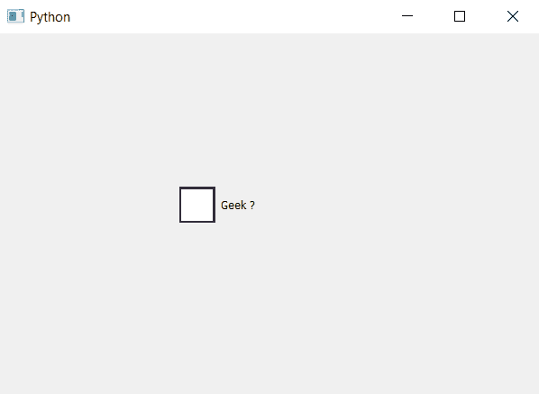

# pyqt 5–更改复选框

中指示器的大小

> 原文:[https://www . geesforgeks . org/pyqt 5-更改复选框中指示器的大小/](https://www.geeksforgeeks.org/pyqt5-changing-size-of-indicator-in-check-box/)

在本文中，我们将看到如何改变指标的大小。指示器是复选框的一部分，虽然如果我们借助`resize`方法或`setGeometry`方法改变复选框的大小，但它会改变复选框的大小，而不是指示器。

为了改变指示器的大小，我们必须改变与复选框对象一起使用的指示器的样式表的高度和宽度。下面是样式表代码。

```py
QCheckBox::indicator
{
width : 40px;
height : 40px;
}

```

下面是实现。

```py
# importing libraries
from PyQt5.QtWidgets import * 
from PyQt5 import QtCore, QtGui
from PyQt5.QtGui import * 
from PyQt5.QtCore import * 
import sys

class Window(QMainWindow):

    def __init__(self):
        super().__init__()

        # setting title
        self.setWindowTitle("Python ")

        # setting geometry
        self.setGeometry(100, 100, 600, 400)

        # calling method
        self.UiComponents()

        # showing all the widgets
        self.show()

    # method for widgets
    def UiComponents(self):

        # creating the check-box
        checkbox = QCheckBox('Geek ?', self)

        # setting geometry of check box
        checkbox.setGeometry(200, 150, 100, 80)

        # setting stylesheet
        # changing width and height of indicator
        checkbox.setStyleSheet("QCheckBox::indicator"
                               "{"
                               "width :40px;"
                               "height : 40px;"
                               "}")

# create pyqt5 app
App = QApplication(sys.argv)

# create the instance of our Window
window = Window()

# start the app
sys.exit(App.exec())
```

**输出:**
