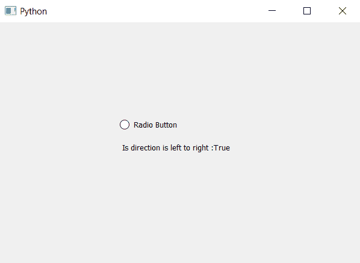

# PyQt5–检查单选按钮是否从左向右对齐

> 原文:[https://www . geesforgeks . org/pyqt 5-检查单选按钮是否从左向右对齐/](https://www.geeksforgeeks.org/pyqt5-check-if-alignment-of-radio-button-is-left-to-right/)

在本文中，我们将看到如何检查单选按钮是否从左向右对齐。默认情况下，单选按钮的对齐方式是从左到右，不过借助`setLayoutDirection`我们可以更改其对齐方式。从左到右的方向基本上是告诉指示器在左边，文字部分在右边。

> **实施概述:**
> 
> 1.创建单选按钮
> 2。将方向设置为单选按钮(可选)
> 3。创建一个标签，显示路线是否从左到右
> 4。借助`isLeftToRight`检查对齐情况，并保存在变量
> 5 中。借助`setText`方法将答案设置到标签上。

下面是实现。

```py
# importing libraries
from PyQt5.QtWidgets import * 
from PyQt5 import QtCore, QtGui
from PyQt5.QtGui import * 
from PyQt5.QtCore import * 
import sys

class Window(QMainWindow):

    def __init__(self):
        super().__init__()

        # setting title
        self.setWindowTitle("Python ")

        # setting geometry
        self.setGeometry(100, 100, 600, 400)

        # calling method
        self.UiComponents()

        # showing all the widgets
        self.show()

    # method for widgets
    def UiComponents(self):

        # creating a radio button
        radio_button = QRadioButton(self)

        # setting geometry of radio button
        radio_button.setGeometry(200, 150, 120, 40)

        # setting text to radio button
        radio_button.setText("Radio Button")

        # setting direction(optional part)
        radio_button.setLayoutDirection(Qt.LeftToRight)

        # creating label to show output
        label = QLabel(self)

        # changing position of label
        label.move(200, 200)

        # check if direction is left to right
        check = radio_button.isLeftToRight()

        # setting output text to label
        label.setText(" Is direction is left to right :" + str(check))

        # adjusting the size of label
        label.adjustSize()

# create pyqt5 app
App = QApplication(sys.argv)

# create the instance of our Window
window = Window()

# start the app
sys.exit(App.exec())
```

**输出:**
