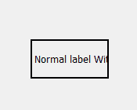
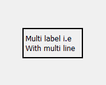
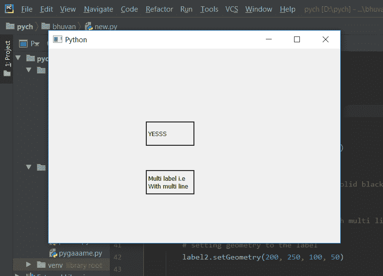

# PyQt5–检查标签是否为多行

> 原文:[https://www . geesforgeks . org/pyqt 5-检查标签是否为多行/](https://www.geeksforgeeks.org/pyqt5-checking-if-label-is-multi-line-or-not/)

在本文中，我们将看到如何检查标签是否是多行的，当我们创建一个标签并为其设置文本时，如果文本长度大于标签额外文本未显示的长度，多行标签会使额外文本进入另一行。下面是普通和多线标签外观的图示

 

为了检查标签是否为多行，我们使用`wordWrap`方法。

> **语法:** label.ordwWrap()
> 
> **论点:**没有论点
> 
> **返回:**返回 bool

下面是实现

```py
# importing libraries
from PyQt5.QtWidgets import * 
from PyQt5 import QtCore, QtGui
from PyQt5.QtGui import * 
from PyQt5.QtCore import * 
import sys

class Window(QMainWindow):

    def __init__(self):
        super().__init__()

        # setting title
        self.setWindowTitle("Python ")

        # setting geometry
        self.setGeometry(100, 100, 600, 400)

        # calling method
        self.UiComponents()

        # showing all the widgets
        self.show()

    # method for widgets
    def UiComponents(self):
        # creating label
        label1 = QLabel(self)

        # setting geometry to the label
        label1.setGeometry(200, 150, 100, 50)

        # adding border to the label
        label1.setStyleSheet("border : 2px solid black;")

        # creating label
        label2 = QLabel("Multi label i.e With multi line", self)

        # setting geometry to the label
        label2.setGeometry(200, 250, 100, 50)

        # adding border to the label
        label2.setStyleSheet("border : 2px solid black;")

        # making it multi line
        label2.setWordWrap(True)

        # check
        check = label2.wordWrap()

        # checking if label2 is multi line or not
        if check:
            label1.setText("YESSS")

        else:
            label1.setText("NOO")

# create pyqt5 app
App = QApplication(sys.argv)

# create the instance of our Window
window = Window()

window.show()

# start the app
sys.exit(App.exec())
```

**输出:**
