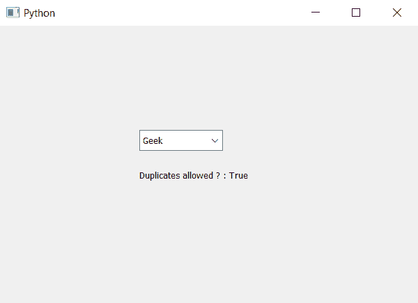

# PyQt5–检查组合框

中是否允许重复值

> 原文:[https://www . geesforgeks . org/pyqt 5-检查重复值是否允许或不允许出现在组合框中/](https://www.geeksforgeeks.org/pyqt5-checking-if-the-duplicate-values-are-allowed-or-not-in-combobox/)

在本文中，我们将看到如何检查是否允许在组合框中重复插入。默认情况下，不允许重复插入，尽管可以通过编程方式将重复项插入组合框，但用户不能插入重复值。为了允许重复插入，我们将使用`setDuplicatesEnabled`方法。

为了知道是否允许重复值，我们使用`duplicatesEnabled`

> **语法:**组合框。重复呈现()
> 
> **论证:**不需要论证
> 
> **返回:**返回 bool

以下是实施–

```py
# importing libraries
from PyQt5.QtWidgets import * 
from PyQt5 import QtCore, QtGui
from PyQt5.QtGui import * 
from PyQt5.QtCore import * 
import sys

class Window(QMainWindow):

    def __init__(self):
        super().__init__()

        # setting title
        self.setWindowTitle("Python ")

        # setting geometry
        self.setGeometry(100, 100, 600, 400)

        # calling method
        self.UiComponents()

        # showing all the widgets
        self.show()

    # method for widgets
    def UiComponents(self):

        # creating a combo box widget
        self.combo_box = QComboBox(self)

        # setting geometry of combo box
        self.combo_box.setGeometry(200, 150, 120, 30)

        # geek list
        geek_list = ["Geek", "Geeky Geek"]

        # adding list of items to combo box
        self.combo_box.addItems(geek_list)

        # making it editable combo box
        self.combo_box.setEditable(True)

        # allowing duplication of items
        # setting duplicates = True
        self.combo_box.setDuplicatesEnabled(True)

        # checking if duplicates are allowed or not
        check = self.combo_box.duplicatesEnabled()

        # creating label to show check
        label = QLabel("Duplicates allowed ? : " + str(check), self)

        # setting geometry of label
        label.setGeometry(200, 200, 200, 30)

# create pyqt5 app
App = QApplication(sys.argv)

# create the instance of our Window
window = Window()

# start the app
sys.exit(App.exec())
```

**输出:**
