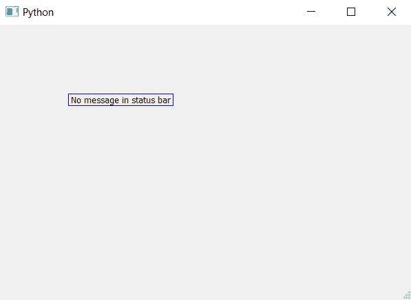

# pyqt 5–clear message()表示状态列

> 哎哎哎:# t0]https://www . geeksforgeeks . org/pyqt 5-clear message-for-status bar/

PyQt5 支持窗口状态栏。这是一个窗口底部的小栏，有时会出现，它可以包含文本消息。`clearMessage()`方法用于清除状态栏上由`showMesaage()`方法设置的消息集。

> **语法:** self.statusBar()。clearMessage()
> 
> **论证:**不需要论证。
> 
> **执行的操作:**清除状态栏中的信息。

**代码:**

```py
from PyQt5.QtCore import * 
from PyQt5.QtGui import * 
from PyQt5.QtWidgets import * 
import sys

class Window(QMainWindow):
    def __init__(self):
        super().__init__()

        # set the title
        self.setWindowTitle("Python")

        # setting  the geometry of window
        self.setGeometry(60, 60, 600, 400)

        # setting status bar message
        self.statusBar().showMessage("this is status bar")

        # clearing the status bar message
        self.statusBar().clearMessage()

        # creating a label widget
        self.label_1 = QLabel("No message in status bar", self)

        # moving position
        self.label_1.move(100, 100)

        # setting up the border
        self.label_1.setStyleSheet("border :1px solid blue;")

        # resizing label
        self.label_1.adjustSize()

        # show all the widgets
        self.show()

# create pyqt5 app
App = QApplication(sys.argv)

# create the instance of our Window
window = Window()

# start the app
sys.exit(App.exec())
```

**输出:**
