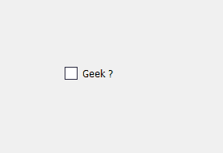
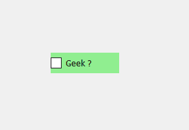
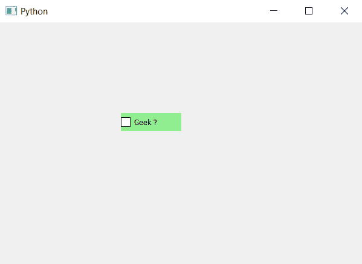

# PyQt5–彩色复选框

> 原文:[https://www.geeksforgeeks.org/pyqt5-colored-check-box/](https://www.geeksforgeeks.org/pyqt5-colored-check-box/)

在本文中，我们将看到如何给复选框添加颜色。当我们创建一个复选框时，它没有颜色，尽管我们可以改变它的颜色。下面是普通复选框和彩色复选框的图示。

 

为了做到这一点，我们必须改变复选框的背景颜色，这可以使用下面的样式表代码来完成。

```
QCheckBox
{
background-color : lightgreen;
}

```

这个样式表和`setStyleSheet`方法一起使用，下面是实现。

```
# importing libraries
from PyQt5.QtWidgets import * 
from PyQt5 import QtCore, QtGui
from PyQt5.QtGui import * 
from PyQt5.QtCore import * 
import sys

class Window(QMainWindow):

    def __init__(self):
        super().__init__()

        # setting title
        self.setWindowTitle("Python ")

        # setting geometry
        self.setGeometry(100, 100, 600, 400)

        # calling method
        self.UiComponents()

        # showing all the widgets
        self.show()

    # method for widgets
    def UiComponents(self):

        # creating the check-box
        checkbox = QCheckBox('Geek ?', self)

        # setting geometry of check box
        checkbox.setGeometry(200, 150, 100, 30)

        # adding background color
        checkbox.setStyleSheet("QCheckBox"
                               "{"
                               "background-color : lightgreen;"
                               "}")

# create pyqt5 app
App = QApplication(sys.argv)

# create the instance of our Window
window = Window()

# start the app
sys.exit(App.exec())
```

**输出:**
