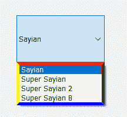

# PyQt5 组合框–不同边框颜色的列表视图部分

> 原文:[https://www . geesforgeks . org/pyqt5-组合框-列表-视图-不同边框颜色的零件/](https://www.geeksforgeeks.org/pyqt5-combo-box-list-view-part-with-different-border-color/)

在本文中，我们将看到如何为组合框列表视图的不同边创建不同的边框颜色。列表视图基本上是显示所有项目的组合框的一部分，下面是不同边框颜色下组合框的外观。



为此，我们必须更改与组合框关联的样式表代码，下面是样式表代码

```
QListView
{
border : 5px solid;
border-color : red green blue yellow;
}

```

下面是实现

```
# importing libraries
from PyQt5.QtWidgets import * 
from PyQt5 import QtCore, QtGui
from PyQt5.QtGui import * 
from PyQt5.QtCore import * 
import sys

class Window(QMainWindow):

    def __init__(self):
        super().__init__()

        # setting title
        self.setWindowTitle("Python ")

        # setting geometry
        self.setGeometry(100, 100, 600, 400)

        # calling method
        self.UiComponents()

        # showing all the widgets
        self.show()

    # method for widgets
    def UiComponents(self):
        # creating a check-able combo box object
        self.combo_box = QComboBox(self)

        # setting geometry of combo box
        self.combo_box.setGeometry(200, 150, 150, 80)

        # geek list
        geek_list = ["Sayian", "Super Sayian", "Super Sayian 2", "Super Sayian B"]

        # adding list of items to combo box
        self.combo_box.addItems(geek_list)

        # setting style sheet
        # adding different border color
        self.combo_box.setStyleSheet("QListView"
                                     "{"
                                     "border : 5px solid;"
                                     "border-color : red green blue yellow;"
                                     "}")

# create pyqt5 app
App = QApplication(sys.argv)

# create the instance of our Window
window = Window()

window.show()

# start the app
sys.exit(App.exec())
```

**输出:**
