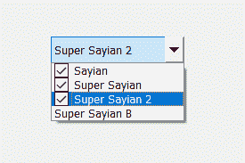
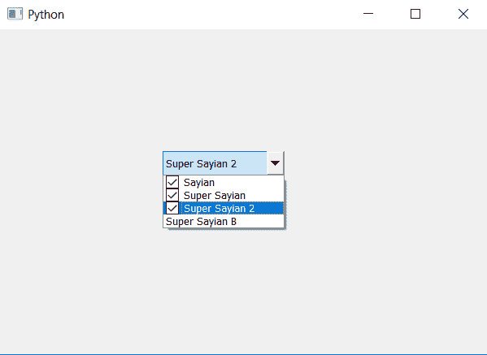

# PyQt5–带有可检查项目的组合框

> 原文:[https://www . geesforgeks . org/pyqt 5-带可检查项目的组合框/](https://www.geeksforgeeks.org/pyqt5-combo-box-with-check-able-items/)

在本文中，我们将看到如何制作一个包含可检查项目的组合框。默认情况下，当我们创建一个组合框时，它的项目是不可检查的，也就是说，我们可以一次选择任何一个项目，尽管我们可以通过编辑组合框类来创建这样的组合框。下面是可检查组合框的外观。


为了做到这一点，我们必须创建一个新的可编辑的组合框类，它继承了组合框并添加了一个新的可检查的组合框功能，下面是新类的语法

```py
class CheckableComboBox(QComboBox):
    def __init__(self, parent = None):
        super(CheckableComboBox, self).__init__(parent)
        self.view().pressed.connect(self.handleItemPressed)
        self.setModel(QStandardItemModel(self))

    def handleItemPressed(self, index):
        item = self.model().itemFromIndex(index)
        if item.checkState() == Qt.Checked:
            item.setCheckState(Qt.Unchecked)
        else:
            item.setCheckState(Qt.Checked)

```

以下是实施–

```py
# importing libraries
from PyQt5.QtWidgets import * 
from PyQt5 import QtCore, QtGui
from PyQt5.QtGui import * 
from PyQt5.QtCore import * 
import sys

# new check-able combo box
class CheckableComboBox(QComboBox):

    # constructor
    def __init__(self, parent = None):
        super(CheckableComboBox, self).__init__(parent)
        self.view().pressed.connect(self.handleItemPressed)
        self.setModel(QStandardItemModel(self))

    # when any item get pressed
    def handleItemPressed(self, index):

        # getting the item
        item = self.model().itemFromIndex(index)

        # checking if item is checked
        if item.checkState() == Qt.Checked:

            # making it unchecked
            item.setCheckState(Qt.Unchecked)

        # if not checked
        else:
            # making the item checked
            item.setCheckState(Qt.Checked)

class Window(QMainWindow):

    def __init__(self):
        super().__init__()

        # setting title
        self.setWindowTitle("Python ")

        # setting geometry
        self.setGeometry(100, 100, 600, 400)

        # calling method
        self.UiComponents()

        # showing all the widgets
        self.show()

    # method for widgets
    def UiComponents(self):

        # creating a check-able combo box object
        self.combo_box = CheckableComboBox(self)

        # setting geometry of combo box
        self.combo_box.setGeometry(200, 150, 150, 30)

        # geek list
        geek_list = ["Sayian", "Super Sayian",
                     "Super Sayian 2", "Super Sayian B"]

        # adding list of items to combo box
        self.combo_box.addItems(geek_list)

# create pyqt5 app
App = QApplication(sys.argv)

# create the instance of our Window
window = Window()

window.show()

# start the app
sys.exit(App.exec())
```

**输出:**
