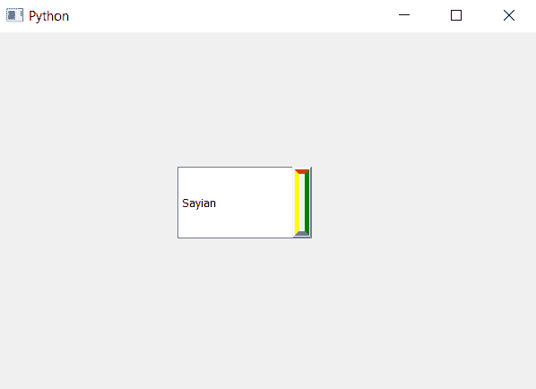

# PyQt5 组合框–向下箭头的不同边框颜色

> 原文:[https://www . geeksforgeeks . org/pyqt 5-combobox-不同-边框-颜色-向下箭头/](https://www.geeksforgeeks.org/pyqt5-combobox-different-border-color-to-down-arrow/)

在本文中，我们将看到如何为向下箭头设置不同的颜色边框，基本上，当我们为向下箭头设置边框时，尽管我们可以改变它的颜色，但它的所有边都是相同的颜色。

为此，我们必须更改与组合框关联的样式表，下面是样式表代码–
**代码 1**

```
QComboBox::down-arrow
{
border : 5px solid;
border-color-top : red;
border-color-right : green;
border-color-bottom : blue;
border-color-left : yellow;
}

```

**代码 2**

```
QComboBox::down-arrow
{
border : 5px solid;
border-color : red green blue yellow
}

```

这两个代码执行类似的任务，只是代码 1 是代码 2 的扩展版本。

下面是实现

```
# importing libraries
from PyQt5.QtWidgets import * 
from PyQt5 import QtCore, QtGui
from PyQt5.QtGui import * 
from PyQt5.QtCore import * 
import sys

class Window(QMainWindow):

    def __init__(self):
        super().__init__()

        # setting title
        self.setWindowTitle("Python ")

        # setting geometry
        self.setGeometry(100, 100, 600, 400)

        # calling method
        self.UiComponents()

        # showing all the widgets
        self.show()

    # method for widgets
    def UiComponents(self):
        # creating a check-able combo box object
        self.combo_box = QComboBox(self)

        # setting geometry of combo box
        self.combo_box.setGeometry(200, 150, 150, 80)

        # making combo box editable
        self.combo_box.setEditable(True)

        # geek list
        geek_list = ["Sayian", "Super Sayian", "Super Sayian 2", "Super Sayian B"]

        # adding list of items to combo box
        self.combo_box.addItems(geek_list)

        # setting style sheet
        # adding different border color to down arrow
        self.combo_box.setStyleSheet("QComboBox::down-arrow"
                                     "{"
                                     "border : 5px solid;"
                                     "border-color : red green blue yellow;"
                                     "}")

# create pyqt5 app
App = QApplication(sys.argv)

# create the instance of our Window
window = Window()

window.show()

# start the app
sys.exit(App.exec())
```

**输出:**
