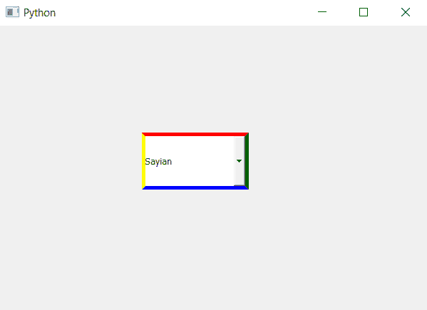

# PyQt5 组合框–处于关闭状态时不同的边框颜色

> 原文:[https://www . geeksforgeeks . org/pyqt 5-combobox-不同边框-处于关闭状态时的颜色/](https://www.geeksforgeeks.org/pyqt5-combobox-different-border-color-when-it-is-in-off-state/)

在本文中，我们将看到如何在组合框处于关闭状态时为其设置不同的边框颜色，当我们为组合框设置边框时，虽然我们可以分别更改每条边的颜色，但所有边的颜色都是相同的。彩色边框只会在组合框处于关闭状态时出现，即列表视图未打开。

为此，我们必须更改与组合框关联的样式表，下面是样式表代码
**代码 1**

```py
QComboBox::!on
{
border : 5px solid;
border-color-top : red;
border-color-right : green;
border-color-bottom : blue;
border-color-left : yellow;
}

```

**代码 2**

```py
QComboBox::!on
{
border : 5px solid;
border-color : red green blue yellow
}

```

两个代码执行类似任务，只是代码 1 是代码 2 的扩展版本

下面是实现

```py
# importing libraries
from PyQt5.QtWidgets import * 
from PyQt5 import QtCore, QtGui
from PyQt5.QtGui import * 
from PyQt5.QtCore import * 
import sys

class Window(QMainWindow):

    def __init__(self):
        super().__init__()

        # setting title
        self.setWindowTitle("Python ")

        # setting geometry
        self.setGeometry(100, 100, 600, 400)

        # calling method
        self.UiComponents()

        # showing all the widgets
        self.show()

    # method for widgets
    def UiComponents(self):
        # creating a check-able combo box object
        self.combo_box = QComboBox(self)

        # setting geometry of combo box
        self.combo_box.setGeometry(200, 150, 150, 80)

        # geek list
        geek_list = ["Sayian", "Super Sayian", "Super Sayian 2", "Super Sayian B"]

        # adding list of items to combo box
        self.combo_box.addItems(geek_list)

        # setting style sheet
        # adding border to combo box
        # adding colorful border when it is OFF
        self.combo_box.setStyleSheet("QComboBox"
                                     "{"
                                     "border : 5px solid black;"
                                     "}"
                                     "QComboBox::! on"
                                     "{"
                                     "border : 5px solid;"
                                     "border-color : red green blue yellow;"                                     
                                     "}")

# create pyqt5 app
App = QApplication(sys.argv)

# create the instance of our Window
window = Window()

window.show()

# start the app
sys.exit(App.exec())
```

**输出:**
