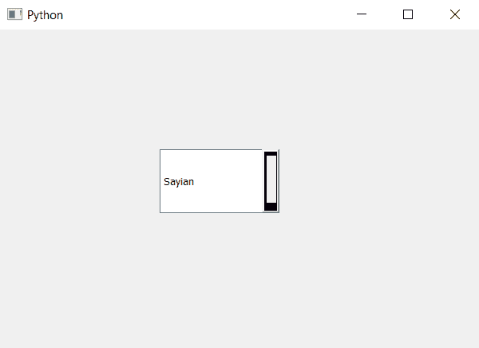

# PyQt5 组合框–向下箭头的不同边框尺寸

> 原文:[https://www . geeksforgeeks . org/pyqt 5-combobox-不同-边框-大小-向下箭头/](https://www.geeksforgeeks.org/pyqt5-combobox-different-border-size-to-down-arrow/)

在本文中，我们将看到如何为向下箭头设置不同的大小/宽度边框，基本上，当我们为向下箭头设置边框时，尽管我们可以更改其颜色，但所有边的宽度都是相同的。

为此，我们必须更改与组合框关联的样式表，下面是样式表代码–
**代码 1**

```py
QComboBox::down-arrow
{
border : solid black;
border-width-top : 5px;
border-width-right : 1px;
border-width-bottom : 10px;
border-width-left : 3px;
}

```

**代码 2**

```py
QComboBox::down-arrow
{
border : solid black;
border-width : 5px 1px 10px 3px;
}

```

这两个代码执行类似的任务，只是代码 1 是代码 2 的扩展版本。

下面是实现

```py
# importing libraries
from PyQt5.QtWidgets import * 
from PyQt5 import QtCore, QtGui
from PyQt5.QtGui import * 
from PyQt5.QtCore import * 
import sys

class Window(QMainWindow):

    def __init__(self):
        super().__init__()

        # setting title
        self.setWindowTitle("Python ")

        # setting geometry
        self.setGeometry(100, 100, 600, 400)

        # calling method
        self.UiComponents()

        # showing all the widgets
        self.show()

    # method for widgets
    def UiComponents(self):
        # creating a check-able combo box object
        self.combo_box = QComboBox(self)

        # setting geometry of combo box
        self.combo_box.setGeometry(200, 150, 150, 80)

        # making combo box editable
        self.combo_box.setEditable(True)

        # geek list
        geek_list = ["Sayian", "Super Sayian", "Super Sayian 2", "Super Sayian B"]

        # adding list of items to combo box
        self.combo_box.addItems(geek_list)

        # setting style sheet
        # adding different border width to down arrow
        self.combo_box.setStyleSheet("QComboBox::down-arrow"
                                     "{"
                                     "border : solid black;"
                                     "border-width : 5px 1px 10px 3px;"
                                     "}")

# create pyqt5 app
App = QApplication(sys.argv)

# create the instance of our Window
window = Window()

window.show()

# start the app
sys.exit(App.exec())
```

**输出:**
