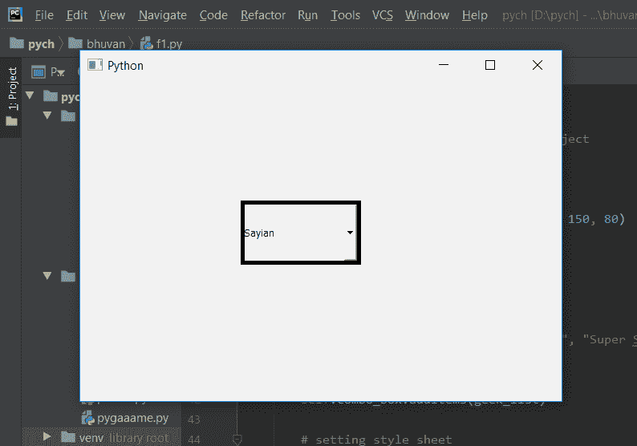
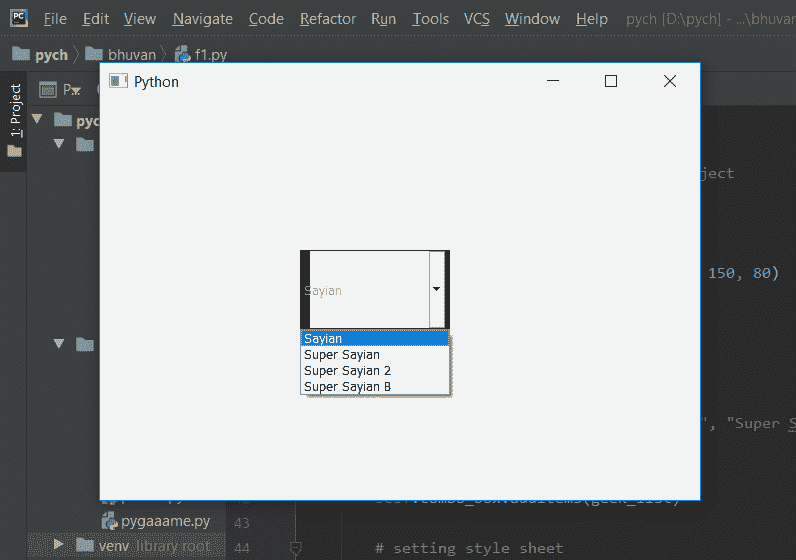

# PyQt5 组合框–不可编辑且处于开启状态时不同的边框尺寸

> 原文:[https://www . geeksforgeeks . org/pyqt 5-combobox-不可编辑时不同边框大小和状态/](https://www.geeksforgeeks.org/pyqt5-combobox-different-border-size-when-non-editable-and-in-on-state/)

在本文中，我们将看到如何在组合框不可编辑且处于打开状态时为其设置不同的边框宽度，当我们为组合框设置边框时，尽管我们可以分别更改每条边的颜色，但它对所有边都是相同的颜色。不同的边框宽度只会出现组合框是不可编辑的，其列表视图是打开的。

**注意:**组合框可以通过`setEditable`方法进行编辑

为此，我们必须更改与组合框相关联的样式表，下面是样式表代码
**代码 1**

```py
QComboBox::!editable:on
{
border : solid black;
border-width-top : 1px;
border-width-right : 5px;
border-width-bottom : 2px;
border-width-left : 10px;
}

```

**代码 2**

```py
QComboBox::!editable:on
{
border : solid black;
border-width : 1px 5px 2px 10px;
}

```

这两个代码执行类似的任务，只是代码 1 是代码 2 的扩展版本。

下面是实现

```py
# importing libraries
from PyQt5.QtWidgets import * 
from PyQt5 import QtCore, QtGui
from PyQt5.QtGui import * 
from PyQt5.QtCore import * 
import sys

class Window(QMainWindow):

    def __init__(self):
        super().__init__()

        # setting title
        self.setWindowTitle("Python ")

        # setting geometry
        self.setGeometry(100, 100, 600, 400)

        # calling method
        self.UiComponents()

        # showing all the widgets
        self.show()

    # method for widgets
    def UiComponents(self):
        # creating a check-able combo box object
        self.combo_box = QComboBox(self)

        # setting geometry of combo box
        self.combo_box.setGeometry(200, 150, 150, 80)

        # making combo box editable
        # self.combo_box.setEditable(True)

        # geek list
        geek_list = ["Sayian", "Super Sayian",
                     "Super Sayian 2", "Super Sayian B"]

        # adding list of items to combo box
        self.combo_box.addItems(geek_list)

        # setting style sheet
        # adding border to combo box
        # adding different width border when it 
        # is non-editable and in on state
        self.combo_box.setStyleSheet("QComboBox"
                                     "{"
                                     "border : 5px solid black;"
                                     "}"
                                     "QComboBox::! editable:on"
                                     "{"
                                     "border : solid black;"
                                     "border-width : 1px 5px 2px 10px;;"
                                     "}")

# create pyqt5 app
App = QApplication(sys.argv)

# create the instance of our Window
window = Window()

window.show()

# start the app
sys.exit(App.exec())
```

**输出:**


打开项目视图时
