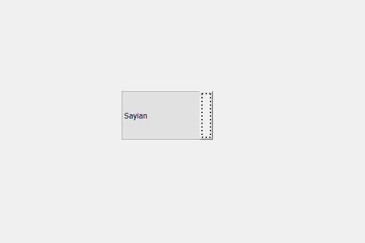

# PyQt5 组合框–将边框样式设置为向下箭头

> 原文:[https://www . geesforgeks . org/pyqt5-combobox-setting-border-style-to-down-arrow/](https://www.geeksforgeeks.org/pyqt5-combobox-setting-border-style-to-down-arrow/)

在本文中，我们将看到如何设置向下箭头的边框样式，基本上，当我们将边框设置为向下箭头时，它是简单的边框，尽管我们可以更改它的样式。

为此，我们必须更改与组合框关联的样式表。下面是样式表代码

```py
QComboBox::down-arrow
{
border : 4px black;
border-style : dotted;
}

```

下面是实现

```py
# importing libraries
from PyQt5.QtWidgets import * 
from PyQt5 import QtCore, QtGui
from PyQt5.QtGui import * 
from PyQt5.QtCore import * 
import sys

class Window(QMainWindow):

    def __init__(self):
        super().__init__()

        # setting title
        self.setWindowTitle("Python ")

        # setting geometry
        self.setGeometry(100, 100, 600, 400)

        # calling method
        self.UiComponents()

        # showing all the widgets
        self.show()

    # method for widgets
    def UiComponents(self):
        # creating a check-able combo box object
        self.combo_box = QComboBox(self)

        # setting geometry of combo box
        self.combo_box.setGeometry(200, 150, 150, 80)

        # geek list
        geek_list = ["Sayian", "Super Sayian", "Super Sayian 2", "Super Sayian B"]

        # adding list of items to combo box
        self.combo_box.addItems(geek_list)

        # setting style sheet
        # adding border to down arrow
        # setting border style to it
        self.combo_box.setStyleSheet("QComboBox::down-arrow"
                                     "{"
                                     "border : 2px black;"
                                     "border-style : dotted;"
                                     "}")

# create pyqt5 app
App = QApplication(sys.argv)

# create the instance of our Window
window = Window()

# start the app
sys.exit(App.exec())
```

**输出:**
