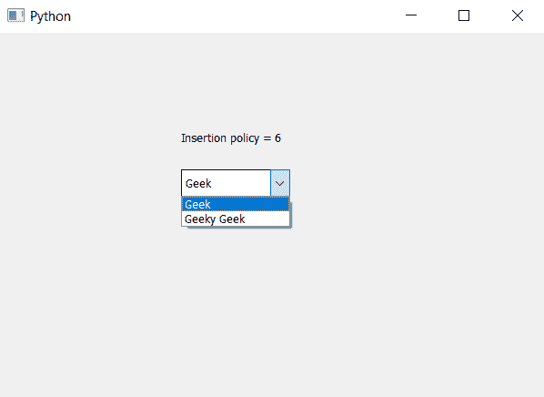
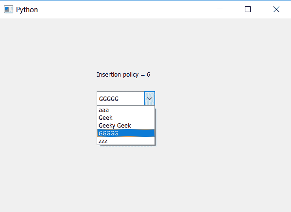

# PyQt5 组合框–用户输入的物品商店字母顺序

> 原文:[https://www . geesforgeks . org/pyqt 5-combobox-用户输入-商品-商店-字母顺序/](https://www.geeksforgeeks.org/pyqt5-combobox-user-entered-items-store-alphabetical-order/)

在本文中，我们将看到用户输入的项目是如何在组合框中按字母顺序添加的，即当用户在可编辑的组合框中插入项目时，它会插入到下拉列表中按字母顺序排列的位置，默认情况下，当用户插入任何项目时，它会插入到底部。

当项目被插入时，它不会替换或覆盖之前在位置的项目，尽管它会移动其他项目的位置以被添加到期望的位置。它不会按照程序添加的字母顺序制作项目。

> 为了制作组合框，使用户插入的项目被添加到下拉列表的字母位置，我们必须执行以下操作–
> 
> 1.创建组合框
> 2。使用设置可编辑方法
> 3 使组合框可编辑。设置组合框的插入策略按字母顺序插入
> 4。创建标签
> 5。检索插入策略并在标签的帮助下显示它

下面是实现

```py
# importing libraries
from PyQt5.QtWidgets import * 
from PyQt5 import QtCore, QtGui
from PyQt5.QtGui import * 
from PyQt5.QtCore import * 
import sys

class Window(QMainWindow):

    def __init__(self):
        super().__init__()

        # setting title
        self.setWindowTitle("Python ")

        # setting geometry
        self.setGeometry(100, 100, 600, 400)

        # calling method
        self.UiComponents()

        # showing all the widgets
        self.show()

    # method for widgets
    def UiComponents(self):

        # creating a combo box widget
        self.combo_box = QComboBox(self)

        # setting geometry of combo box
        self.combo_box.setGeometry(200, 150, 120, 30)

        # geek list
        geek_list = ["Geek", "Geeky Geek"]

        # adding list of items to combo box
        self.combo_box.addItems(geek_list)

        # creating editable combo box
        self.combo_box.setEditable(True)

        # setting insertion policy
        # new item will get added alphabetically
        self.combo_box.setInsertPolicy(QComboBox.InsertAlphabetically)

        # getting current insertion policy
        policy = self.combo_box.insertPolicy()

        # creating label to  print the policy
        label = QLabel("Insertion policy = " + str(policy), self)

        # setting geometry of the label
        label.setGeometry(200, 100, 200, 30)

# create pyqt5 app
App = QApplication(sys.argv)

# create the instance of our Window
window = Window()

# start the app
sys.exit(App.exec())
```

**输出:**

插入前


插入后
