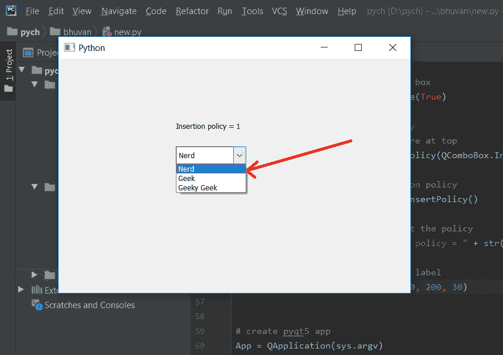

# PyQt5 组合框–用户输入的物品存储在顶部

> 原文:[https://www . geeksforgeeks . org/pyqt 5-combobox-用户输入-商品-顶部商店/](https://www.geeksforgeeks.org/pyqt5-combobox-user-entered-items-store-at-top/)

在本文中，我们将看到用户如何在开始时在组合框中添加项目，即当用户在可编辑的组合框中插入项目时，它会被插入到下拉列表的顶部，默认情况下，当用户插入任何项目时，它会被插入到底部。

> 为了使用户插入的项目添加到下拉列表的顶部，我们必须执行以下操作–
> 1。创建组合框
> 2。使用设置可编辑方法
> 3 使组合框可编辑。将组合框的插入策略设置为顶部插入
> 4。创建标签
> 5。检索插入策略并借助标签
> 显示

下面是实现

## 蟒蛇 3

```py
# importing libraries
from PyQt5.QtWidgets import *
from PyQt5 import QtCore, QtGui
from PyQt5.QtGui import *
from PyQt5.QtCore import *
import sys

class Window(QMainWindow):

    def __init__(self):
        super().__init__()

        # setting title
        self.setWindowTitle("Python ")

        # setting geometry
        self.setGeometry(100, 100, 600, 400)

        # calling method
        self.UiComponents()

        # showing all the widgets
        self.show()

    # method for widgets
    def UiComponents(self):

        # creating a combo box widget
        self.combo_box = QComboBox(self)

        # setting geometry of combo box
        self.combo_box.setGeometry(200, 150, 120, 30)

        # geek list
        geek_list = ["Geek", "Geeky Geek"]

        # adding list of items to combo box
        self.combo_box.addItems(geek_list)

        # creating editable combo box
        self.combo_box.setEditable(True)

        # setting insertion policy
        # making insertion to store at top
        self.combo_box.setInsertPolicy(QComboBox.InsertAtTop)

        # getting current insertion policy
        policy = self.combo_box.insertPolicy()

        # creating label to  print the policy
        label = QLabel("Insertion policy = " + str(policy), self)

        # setting geometry of the label
        label.setGeometry(200, 100, 200, 30)

# create pyqt5 app
App = QApplication(sys.argv)

# create the instance of our Window
window = Window()

# start the app
sys.exit(App.exec())
```

**输出:**

