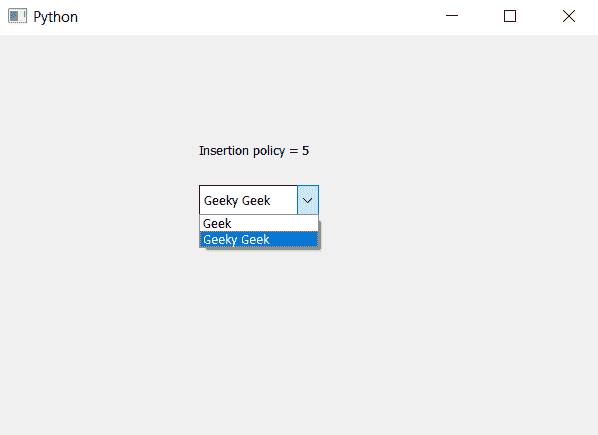
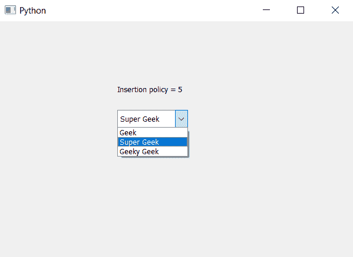

# PyQt5 组合框–用户在所选位置之前输入的物品商店

> 原文:[https://www . geeksforgeeks . org/pyqt 5-combobox-用户输入的项目-选定职位前的商店/](https://www.geeksforgeeks.org/pyqt5-combobox-user-entered-items-store-before-the-selected-position/)

在本文中，我们将看到用户输入的项目是如何在组合框的当前选定位置之前添加的，即当用户在可编辑组合框中插入项目时，它会插入到下拉列表中当前选定项目之前的位置，默认情况下，当用户插入任何项目时，它会插入到底部。

注意:当项目被插入时，它不会替换或覆盖当前位置之前的项目，尽管它会移动其他项目的位置以被添加到所需的位置

> 为了制作组合框，使用户插入的项目被添加到下拉列表中的选定位置之前，我们必须执行以下操作–
> 
> 1.创建组合框
> 2。使用设置可编辑方法
> 3 使组合框可编辑。将组合框的插入策略设置为在当前
> 4 之前插入。创建标签
> 5。检索插入策略并在标签的帮助下显示它

下面是实现

```
# importing libraries
from PyQt5.QtWidgets import * 
from PyQt5 import QtCore, QtGui
from PyQt5.QtGui import * 
from PyQt5.QtCore import * 
import sys

class Window(QMainWindow):

    def __init__(self):
        super().__init__()

        # setting title
        self.setWindowTitle("Python ")

        # setting geometry
        self.setGeometry(100, 100, 600, 400)

        # calling method
        self.UiComponents()

        # showing all the widgets
        self.show()

    # method for widgets
    def UiComponents(self):

        # creating a combo box widget
        self.combo_box = QComboBox(self)

        # setting geometry of combo box
        self.combo_box.setGeometry(200, 150, 120, 30)

        # geek list
        geek_list = ["Geek", "Geeky Geek"]

        # adding list of items to combo box
        self.combo_box.addItems(geek_list)

        # creating editable combo box
        self.combo_box.setEditable(True)

        # setting insertion policy
        # new item will get added before the selected place
        self.combo_box.setInsertPolicy(QComboBox.InsertBeforeCurrent)

        # getting current insertion policy
        policy = self.combo_box.insertPolicy()

        # creating label to  print the policy
        label = QLabel("Insertion policy = " + str(policy), self)

        # setting geometry of the label
        label.setGeometry(200, 100, 200, 30)

# create pyqt5 app
App = QApplication(sys.argv)

# create the instance of our Window
window = Window()

# start the app
sys.exit(App.exec())
```

**输出:**
插入文字前
插入文字后

