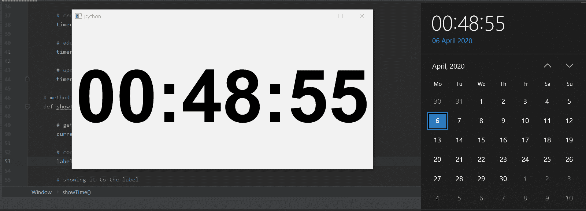

# pyqt 5–创建数字时钟

> 原文:[https://www.geeksforgeeks.org/pyqt5-create-a-digital-clock/](https://www.geeksforgeeks.org/pyqt5-create-a-digital-clock/)

在本文中，我们将看到如何使用 PyQt5 创建一个数字时钟，这个数字时钟将基本上以 24 小时格式告诉当前时间。

> **为了创建数字时钟，我们必须执行以下操作:**
> 
> 1.创建垂直布局
> 2。创建标签以显示当前时间，并将其放入布局中，并与中心对齐。
> 3。创建一个 QTimer 对象
> 4。向 QTimer 对象添加操作，以便在每次调用 1sec 操作方法后。
> 5。在动作方法中，获取当前时间，并借助标签显示该时间。

以下是实施–

```
# importing required librarie
import sys
from PyQt5.QtWidgets import QApplication, QWidget
from PyQt5.QtWidgets import QVBoxLayout, QLabel
from PyQt5.QtGui import QFont
from PyQt5.QtCore import QTimer, QTime, Qt

class Window(QWidget):

    def __init__(self):
        super().__init__()

        # setting geometry of main window
        self.setGeometry(100, 100, 800, 400)

        # creating a vertical layout
        layout = QVBoxLayout()

        # creating font object
        font = QFont('Arial', 120, QFont.Bold)

        # creating a label object
        self.label = QLabel()

        # setting centre alignment to the label
        self.label.setAlignment(Qt.AlignCenter)

        # setting font to the label
        self.label.setFont(font)

        # adding label to the layout
        layout.addWidget(self.label)

        # setting the layout to main window
        self.setLayout(layout)

        # creating a timer object
        timer = QTimer(self)

        # adding action to timer
        timer.timeout.connect(self.showTime)

        # update the timer every second
        timer.start(1000)

    # method called by timer
    def showTime(self):

        # getting current time
        current_time = QTime.currentTime()

        # converting QTime object to string
        label_time = current_time.toString('hh:mm:ss')

        # showing it to the label
        self.label.setText(label_time)

# create pyqt5 app
App = QApplication(sys.argv)

# create the instance of our Window
window = Window()

# showing all the widgets
window.show()

# start the app
App.exit(App.exec_())
```

**输出:**
