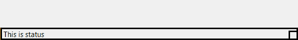
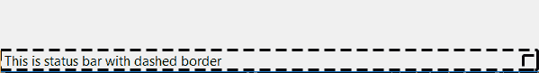
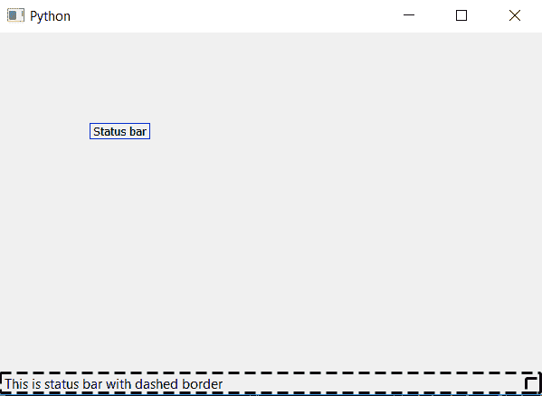

# PyQt5–创建状态栏的虚线边框

> 原文:[https://www . geesforgeks . org/pyqt5-create-虚线-状态栏边框/](https://www.geeksforgeeks.org/pyqt5-create-dashed-border-of-status-bar/)

在本文中，我们将看到如何在 PyQt5 应用程序中创建状态栏的虚线边框。一般来说，当我们创建一个带有边框的状态栏时，边框是连续的，但是我们也可以制作一个虚线边框，下图是普通边框和虚线边框的区别。





为了做到这一点，我们将使用`setStyleSheet()`方法。

> **语法:** self.statusBar()。set 样式表(“边框:3px 黑色；边框样式:虚线)
> 
> **自变量:**它以字符串为自变量。
> 
> **执行的动作:**设置虚线边框。

**代码:**

```py
from PyQt5.QtCore import * 
from PyQt5.QtGui import * 
from PyQt5.QtWidgets import * 
import sys

class Window(QMainWindow):
    def __init__(self):
        super().__init__()

        # set the title
        self.setWindowTitle("Python")

        # setting  the geometry of window
        self.setGeometry(60, 60, 600, 400)

        # setting status bar message
        self.statusBar().showMessage("This is status bar with dashed border")

        # setting dashed border to status bar
        self.statusBar().setStyleSheet("border :3px black;  
                                        border-style : dashed")

        # creating a label widget
        self.label_1 = QLabel("Status bar", self)

        # moving position
        self.label_1.move(100, 100)

        # setting up the border
        self.label_1.setStyleSheet("border :1px solid blue;")

        # resizing label
        self.label_1.adjustSize()

        # show all the widgets
        self.show()

# create pyqt5 app
App = QApplication(sys.argv)

# create the instance of our Window
window = Window()

# start the app
sys.exit(App.exec())
```

**输出:**
