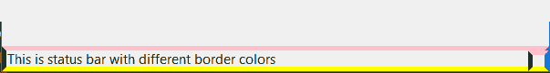
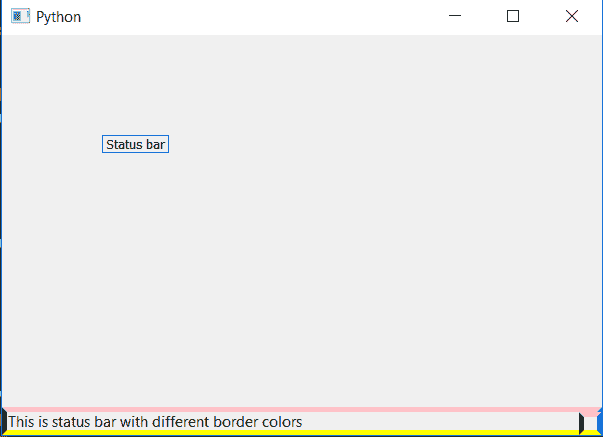

# PyQt5–创建状态栏的多色边框

> 原文:[https://www . geeksforgeeks . org/pyqt 5-create-多色-statusbar 边框/](https://www.geeksforgeeks.org/pyqt5-create-multi-color-border-of-statusbar/)

当我们创建一个状态栏的边框时，它是相同的颜色，即所有的边都是相同的颜色。在本教程中，我们将看到如何创建多色边框，即所有的边缘是不同的颜色。




为了做到这一点，我们将使用`setStyleSheet()`方法。

> **语法:**
> 
> ```
> self.statusBar().setStyleSheet("border :5px solid ;"
>                                "border-top-color : pink; "
>                                "border-left-color :green;"
>                                "border-right-color :blue;"
>                                "border-bottom-color : yellow")
> 
> ```
> 
> **自变量:**它以字符串为自变量。
> 
> **执行的动作:**改变每个边框的颜色。

**代码:**

```
from PyQt5.QtCore import * 
from PyQt5.QtGui import * 
from PyQt5.QtWidgets import * 
import sys

class Window(QMainWindow):
    def __init__(self):
        super().__init__()

        # set the title
        self.setWindowTitle("Python")

        # setting  the geometry of window
        self.setGeometry(60, 60, 600, 400)

        # setting status bar message
        self.statusBar().showMessage("This is status bar with different border colors")

        # setting border color for different edge to status bar
        self.statusBar().setStyleSheet("border :5px solid ;"
                                       "border-top-color : pink; "
                                       "border-left-color :green;"
                                       "border-right-color :blue;"
                                       "border-bottom-color : yellow")

        # creating a label widget
        self.label_1 = QLabel("Status bar", self)

        # moving position
        self.label_1.move(100, 100)

        # setting up the border
        self.label_1.setStyleSheet("border :1px solid blue;")

        # resizing label
        self.label_1.adjustSize()

        # show all the widgets
        self.show()

# create pyqt5 app
App = QApplication(sys.argv)

# create the instance of our Window
window = Window()

# start the app
sys.exit(App.exec())
```

**输出:**
