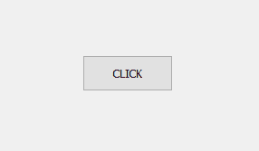
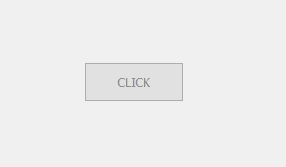
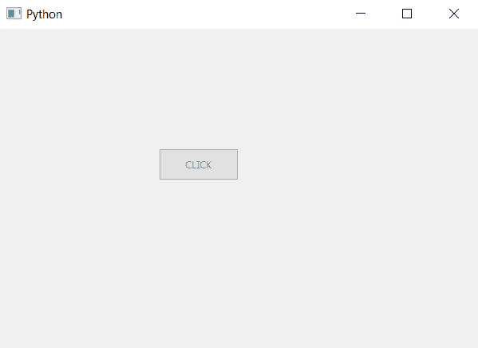

# pyqt 5–创建半透明按钮

> 原文:[https://www . geesforgeks . org/pyqt 5-create-半透明-按钮/](https://www.geeksforgeeks.org/pyqt5-create-translucent-push-button/)

在本文中，我们将看到如何创建半透明按钮，这里半透明指的是不是完全不透明的按钮。

为了做到这一点，我们必须改变按钮的 alpha 级别，alpha 级别是不透明因子越大 alpha 的值越大对象越不透明，但是不像主窗口我们不能使用`setWindowOpacity`方法，因此为了改变 alpha 值我们会使用`setStyleSheet`方法。

下面是普通按钮和半透明按钮的区别。

 

> **语法:**button .set 样式表(“颜色:rgba(0，0，0，100)”)
> 
> **自变量:**它以字符串为自变量。这里的 Rgba 指的是红、绿、蓝和 alpha 级别，它们都从 0 到 255 不等。
> 
> **执行的动作:**将设置按钮的α级

**代码:**

```
# importing libraries
from PyQt5.QtWidgets import * 
from PyQt5.QtGui import * 
from PyQt5.QtCore import * 
import sys

class Window(QMainWindow):
    def __init__(self):
        super().__init__()

        # setting title
        self.setWindowTitle("Python ")

        # setting geometry
        self.setGeometry(100, 100, 600, 400)

        # calling method
        self.UiComponents()

        # showing all the widgets
        self.show()

    # method for widgets
    def UiComponents(self):

        # creating a push button
        button = QPushButton("CLICK", self)

        # setting geometry of button
        button.setGeometry(200, 150, 100, 40)

        # setting alpha level
        button.setStyleSheet("color : rgba(0, 0, 0, 100)")

        # adding action to a button
        button.clicked.connect(self.clickme)

    # action method
    def clickme(self):

        # printing pressed
        print("pressed")

# create pyqt5 app
App = QApplication(sys.argv)

# create the instance of our Window
window = Window()

# start the app
sys.exit(App.exec())
```

**输出:**
