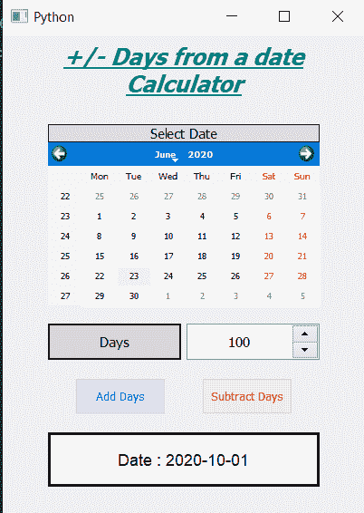

# PyQt5–起始日期计算器

> 原文:[https://www . geeksforgeeks . org/pyqt5-日期起算器/](https://www.geeksforgeeks.org/pyqt5-days-from-date-calculator/)

在本文中，我们将看到如何在 PyQt5 中创建一个从日期开始的天数计算器，从日期开始的天数计算器用于从所选日期中添加或减去天数，以获得新的日期。这个计算器用来得到给定天数后的确切日期。下面是计算器的样子



**PyQt5** 是跨平台的 GUI 工具包，一套针对 Qt v5 的 python 绑定。由于该库提供的工具和简单性，人们可以非常容易地开发交互式桌面应用程序。下面是安装 PyQt5 的命令

```
pip install PyQt5
```

> **GUI 实现步骤:**
> 1。创建显示计算器名称
> 2 的标题标签。创建标签显示用户选择日期
> 3。创建一个 QCalendarWidget 对象供用户选择日期
> 4。创建一个标签和旋转框，告诉用户输入天数并获得天数
> 5。创建两个加减天数的按钮
> 6。创建一个标签来显示计算的日期
> 
> **后端实现:**
> 1。向两个按钮
> 2 添加动作。在添加按钮操作中，获取天数并调用计算方法，将天数作为参数传递
> 3。在减法按钮操作中，获取天数并使天数为负，调用计算方法并将天数作为参数
> 4 传递。在计算方法里面得到日历的选定日期
> 5。将过去的天数添加到所选日期
> 6。借助结果标签显示新日期

下面是实现

```
# importing libraries
from PyQt5.QtWidgets import * 
from PyQt5 import QtCore, QtGui
from PyQt5.QtGui import * 
from PyQt5.QtCore import * 
import datetime
import sys

class Window(QMainWindow):

    def __init__(self):
        super().__init__()

        # setting title
        self.setWindowTitle("Python ")

        # width of window
        self.w_width = 400

        # height of window
        self.w_height = 530

        # setting geometry
        self.setGeometry(100, 100, self.w_width, self.w_height)

        # calling method
        self.UiComponents()

        # showing all the widgets
        self.show()

    # method for components
    def UiComponents(self):
        # creating head label
        head = QLabel("+/- Days from a date Calculator", self)

        head.setWordWrap(True)

        # setting geometry to the head
        head.setGeometry(0, 10, 400, 60)

        # font
        font = QFont('Times', 15)
        font.setBold(True)
        font.setItalic(True)
        font.setUnderline(True)

        # setting font to the head
        head.setFont(font)

        # setting alignment of the head
        head.setAlignment(Qt.AlignCenter)

        # setting color effect to the head
        color = QGraphicsColorizeEffect(self)
        color.setColor(Qt.darkCyan)
        head.setGraphicsEffect(color)

        # creating a label
        b_label = QLabel("Select Date", self)

        # setting properties  label
        b_label.setAlignment(Qt.AlignCenter)
        b_label.setGeometry(50, 100, 300, 20)
        b_label.setStyleSheet("QLabel"
                              "{"
                              "border : 1px solid black;"
                              "background : rgba(70, 70, 70, 25);"
                              "}")
        b_label.setFont(QFont('Times', 9))

        # creating a calendar widget to select the date
        self.calendar = QCalendarWidget(self)

        # setting geometry of the calendar
        self.calendar.setGeometry(50, 120, 300, 180)

        # setting font to the calendar
        self.calendar.setFont(QFont('Times', 6))

        # creating a label
        days_label = QLabel("Days", self)

        # setting geometry to the label
        days_label.setGeometry(50, 320, 147, 40)

        # setting alignment
        days_label.setAlignment(Qt.AlignCenter)

        # setting stylesheet
        days_label.setStyleSheet("QLabel"
                                 "{"
                                 "border : 2px solid black;"
                                 "background : rgba(70, 70, 70, 35);"
                                 "}")

        days_label.setFont(QFont('Times', 9))

        # creating a spin box to get the days
        self.days = QSpinBox(self)

        # setting geometry to the spin box
        self.days.setGeometry(203, 320, 147, 40)

        # setting maximum value of spin box
        self.days.setMaximum(99999999)

        # setting font and alignment
        self.days.setFont(QFont('Times', 9))
        self.days.setAlignment(Qt.AlignCenter)

        # creating a push button
        add = QPushButton("Add Days", self)

        # setting geometry to the push button
        add.setGeometry(80, 380, 100, 40)

        # adding action to the button
        add.clicked.connect(self.add_action)

        # adding color effect to the push button
        color = QGraphicsColorizeEffect()
        color.setColor(Qt.blue)
        add.setGraphicsEffect(color)

        # creating a push button
        subtract = QPushButton("Subtract Days", self)

        # setting geometry to the push button
        subtract.setGeometry(220, 380, 100, 40)

        # adding action to the  button
        subtract.clicked.connect(self.subtract_action)

        # adding color effect to the push button
        color = QGraphicsColorizeEffect()
        color.setColor(Qt.red)
        subtract.setGraphicsEffect(color)

        # creating a label to show result
        self.result = QLabel(self)

        # setting properties to result label
        self.result.setAlignment(Qt.AlignCenter)

        # setting geometry
        self.result.setGeometry(50, 440, 300, 60)

        # making it multi line
        self.result.setWordWrap(True)

        # setting stylesheet
        # adding border and background
        self.result.setStyleSheet("QLabel"
                                  "{"
                                  "border : 3px solid black;"
                                  "background : white;"
                                  "}")

        # setting font
        self.result.setFont(QFont('Arial', 11))

    # method called by the add push button
    def add_action(self):

        # get the days from the spin box
        days = self.days.value()

        # call the calculate action
        self.calculate(days)

    # method called by the subtract push button
    def subtract_action(self):

        # get the days from the spin box
        # make the days value negative
        days = 0 - self.days.value()

        # call the calculate action
        self.calculate(days)

    def calculate(self, days):

        # get the selected date of calendar
        selected_date = self.calendar.selectedDate()

        # adding days to the selected days
        new_date = selected_date.addDays(days)

        # showing this date through label
        self.result.setText("Date : " + new_date.toString(Qt.ISODate))

# create pyqt5 app
App = QApplication(sys.argv)

# create the instance of our Window
window = Window()

# start the app
sys.exit(App.exec())
```

**输出:**

<video class="wp-video-shortcode" id="video-436606-1" width="640" height="848" preload="metadata" controls=""><source type="video/mp4" src="https://media.geeksforgeeks.org/wp-content/uploads/20200623005757/Python-2020-06-23-00-56-07.mp4?_=1">[https://media.geeksforgeeks.org/wp-content/uploads/20200623005757/Python-2020-06-23-00-56-07.mp4](https://media.geeksforgeeks.org/wp-content/uploads/20200623005757/Python-2020-06-23-00-56-07.mp4)</video>