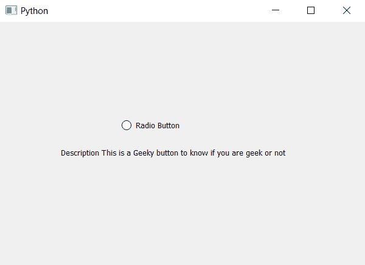

# PyQt5–单选按钮

的描述

> 原文:[https://www . geesforgeks . org/pyqt 5-单选按钮描述/](https://www.geeksforgeeks.org/pyqt5-description-of-radio-button/)

在本文中，我们将了解如何设置和访问单选按钮的描述。描述基本上是关于单选按钮的详细信息，因为当我们创建图形用户界面时，我们制作了许多单选按钮，并且需要描述它们，因为一些单选按钮将用于选择过滤器，一些将用于选择颜色等，因此需要描述。描述将告诉使用和程序我们需要知道的关于特定单选按钮的所有事情。

为了访问我们使用的`accessibleDescription`方法和为了设置描述我们使用的`setAccessibleDescription`方法。

> 设置描述–
> **语法:**单选按钮. setaccessibledescription(info)
> **参数:**以字符串为参数
> **返回:**无
> 
> 用于访问描述–
> **语法:**单选按钮. accessibleDescription()
> **参数:**不需要参数
> **返回:**返回字符串

**实施程序:**
1。创建单选按钮
2。借助 setAccessibleDescription 方法
3 给它设置描述。创建标签以显示信息
4。借助 accessibleDescription 方法访问单选按钮的描述，并将其存储在变量
5 中。借助 setText 方法将此描述设置为标签

以下是实施–

```py
# importing libraries
from PyQt5.QtWidgets import * 
from PyQt5 import QtCore, QtGui
from PyQt5.QtGui import * 
from PyQt5.QtCore import * 
import sys

class Window(QMainWindow):

    def __init__(self):
        super().__init__()

        # setting title
        self.setWindowTitle("Python ")

        # setting geometry
        self.setGeometry(100, 100, 600, 400)

        # calling method
        self.UiComponents()

        # showing all the widgets
        self.show()

    # method for widgets
    def UiComponents(self):
        # creating a radio button
        self.radio_button = QRadioButton(self)

        # setting geometry of radio button
        self.radio_button.setGeometry(200, 150, 120, 40)

        # setting text to radio button
        self.radio_button.setText("Radio Button")

        # setting description to radio button
        self.radio_button.setAccessibleDescription(
            "This is a Geeky button to know if you are geek or not")

        # creating label to display button name
        label = QLabel(self)

        # setting geometry
        label.setGeometry(100, 200, 400, 30)

        # accessing the description
        info = self.radio_button.accessibleDescription()

        # showing description in label
        label.setText("Description " + info)

# create pyqt5 app
App = QApplication(sys.argv)

# create the instance of our Window
window = Window()

# start the app
sys.exit(App.exec())
```

**输出:**
