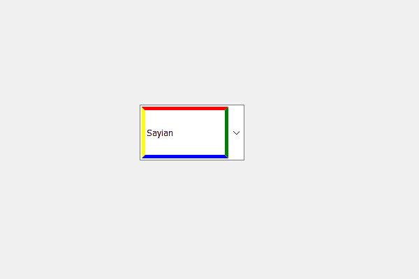

# pyqt 5–不可编辑组合框

的线条编辑部分的不同边框颜色

> 原文:[https://www . geesforgeks . org/pyqt 5-不同边框颜色到线条编辑-不可编辑部分-组合框/](https://www.geeksforgeeks.org/pyqt5-different-border-color-to-lineedit-part-for-non-editable-combo-box/)

在本文中，我们将看到如何为不可编辑组合框的线条编辑部分设置不同的边框颜色，线条编辑是组合框中显示选定项目的部分，它本质上是可编辑的。为了设置和访问线编辑对象，我们分别使用`setLineEdit`和线编辑方法。

> 为此，我们必须执行以下操作:
> 
> 1.创建组合框
> 2。向组合框
> 3 添加项目。创建一个 QLineEdit 对象
> 4。给 QLineEdit 对象设置不同颜色的边框
> 5。使线编辑对象不可编辑(只读)
> 6。将 QLineEdit 对象添加到组合框中

下面是实现

```
# importing libraries
from PyQt5.QtWidgets import * 
from PyQt5 import QtCore, QtGui
from PyQt5.QtGui import * 
from PyQt5.QtCore import * 
import sys

class Window(QMainWindow):

    def __init__(self):
        super().__init__()

        # setting title
        self.setWindowTitle("Python ")

        # setting geometry
        self.setGeometry(100, 100, 600, 400)

        # calling method
        self.UiComponents()

        # showing all the widgets
        self.show()

    # method for widgets
    def UiComponents(self):
        # creating a check-able combo box object
        self.combo_box = QComboBox(self)

        # setting geometry of combo box
        self.combo_box.setGeometry(200, 150, 150, 80)

        # geek list
        geek_list = ["Sayian", "Super Sayian", "Super Sayian 2", "Super Sayian B"]

        # adding list of items to combo box
        self.combo_box.addItems(geek_list)

        # creating line edit object
        line_edit = QLineEdit()

        # setting border to the line edit part
        # set different border color
        line_edit.setStyleSheet("QLineEdit"
                                "{"
                                "border : 5px solid ;"
                                "border-color : red green blue yellow"
                                "}")

        # making line edit object read only
        line_edit.setReadOnly(True)

        # adding line edit object to the combo box
        self.combo_box.setLineEdit(line_edit)

# create pyqt5 app
App = QApplication(sys.argv)

# create the instance of our Window
window = Window()

# start the app
sys.exit(App.exec())
```

**输出:**
