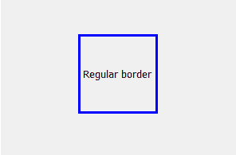
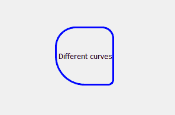
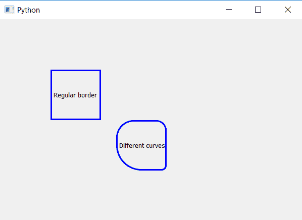

# PyQt5–标签的不同边界角

> 原文:[https://www . geeksforgeeks . org/pyqt 5-不同边界-标签角/](https://www.geeksforgeeks.org/pyqt5-different-border-corner-of-label/)

在本文中，我们将看到如何为不同的拐角制作不同类型的曲线。我们可以使用`setStyleSheet()`方法为标签制作边框，但是默认边框在拐角处有直角，即没有任何曲线，但是我们也可以通过设置`border-radius`来使用制作曲线。这将在所有四个拐角处形成相同的曲线。

以下是不同拐角处不同曲线与正常边框的对比示例:

 

这可以使用`setStyleSheet()`完成:

> **语法:**
> 
> ```py
> label.setStyleSheet("border :3px solid blue;"
>                     "border-top-left-radius :35px;"
>                     "border-top-right-radius : 20px; "
>                     "border-bottom-left-radius : 50px; "
>                     "border-bottom-right-radius : 10px")
> 
> ```
> 
> **自变量:**它以字符串为自变量。
> **执行的动作:**改变每个角落的曲线。

**代码:**

```py
# importing the required libraries

from PyQt5.QtCore import * 
from PyQt5.QtGui import * 
from PyQt5.QtWidgets import * 
import sys

class Window(QMainWindow):
    def __init__(self):
        super().__init__()

        # set the title
        self.setWindowTitle("Python")

        # setting  the geometry of window
        self.setGeometry(60, 60, 600, 400)

        # creating a label widget
        self.label_1 = QLabel("Regular border", self)

        # moving position
        self.label_1.move(100, 100)

        # setting up the border
        self.label_1.setStyleSheet("border :3px solid blue;")

        # resizing label
        self.label_1.resize(100, 100)
        # creating a label widget
        self.label_2 = QLabel("Different curves", self)

        # moving position
        self.label_2.move(230, 200)

        # setting curves at each corner
        self.label_2.setStyleSheet("border :3px solid blue;"
                                   "border-top-left-radius :35px;"
                                   " border-top-right-radius : 20px; "
                                   "border-bottom-left-radius : 50px; "
                                   "border-bottom-right-radius : 10px")

        # resizing the label
        self.label_2.resize(100, 100)

        # show all the widgets
        self.show()

# create pyqt5 app
App = QApplication(sys.argv)

# create the instance of our Window
window = Window()
# start the app
sys.exit(App.exec())
```

**输出:**

