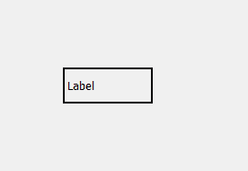
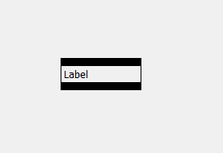
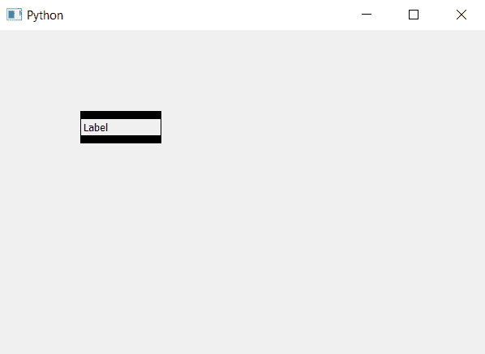

# pyqt 5–标签

中每一侧的不同边框尺寸

> 原文:[https://www . geeksforgeeks . org/pyqt 5-标签中每一面的不同边框尺寸/](https://www.geeksforgeeks.org/pyqt5-different-border-size-for-each-side-in-label/)

在本文中，我们将看到如何为标签设置不同的边框大小，默认情况下，没有为标签设置边框，尽管我们可以通过使用样式表设置边框来为标签添加边框，但是该边框是统一的，并且四个边的大小相同。

下图是普通带边框标签与不同边框尺寸标签的对比。
 

> **语法:**
> 
> ```
> label.setStyleSheet("border : solid black;"
>      "border-width : 10px 1px 10px 1px;")
> ```
> 
> **说明:** `border-width`用于设置厚度第一个元素指上侧的厚度，第二个元素指右侧，第三个元素指底侧，第四个元素指左侧。

下面是实现。

```
# importing the required libraries

from PyQt5.QtCore import * 
from PyQt5.QtGui import * 
from PyQt5.QtWidgets import * 
import sys

class Window(QMainWindow):
    def __init__(self):
        super().__init__()

        # set the title
        self.setWindowTitle("Python")

        # setting geometry
        self.setGeometry(100, 100, 600, 400)

        # creating a label widget
        self.label_1 = QLabel("Label ", self)

        # setting up the border with different size
        self.label_1.setStyleSheet("border : solid black;"
                                   "border-width : 10px 1px 10px 1px;")

        # resizing the label
        self.label_1.resize(100, 40)

        # moving the label
        self.label_1.move(100, 100)

        # show all the widgets
        self.update()
        self.show()

# create pyqt5 app
App = QApplication(sys.argv)

# create the instance of our Window
window = Window()

# start the app
sys.exit(App.exec())
```

**输出:**
