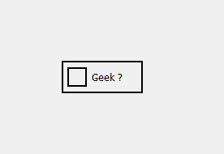
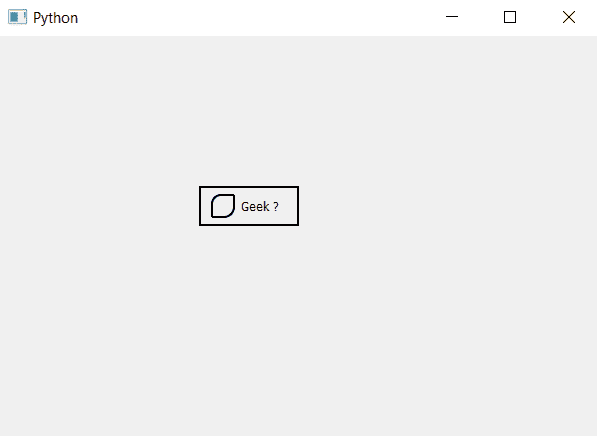

# pyqt 5–复选框

中不同的弯曲指示器角

> 原文:[https://www . geeksforgeeks . org/pyqt 5-不同-弯曲-指示器-角落-复选框/](https://www.geeksforgeeks.org/pyqt5-different-curved-indicator-corner-in-checkbox/)

在本文中，我们将看到如何在复选框中的指示器的不同角落设置不同的曲线，尽管借助于改变半径，我们可以将方形指示器变为圆形指示器。

下面是普通指示器和不同弯曲指示器的图示。
 

为此，我们必须更改指示器的样式表代码，并添加不同的曲线。

```
QCheckBox::indicator
{
border : 2px solid black; 
width : 20px;
height : 20px;
border-top-left-radius :10px;
border-top-right-radius : 1px; 
border-bottom-left-radius : 1px; 
border-bottom-right-radius : 11px
}

```

以下是实施–

```
# importing libraries
from PyQt5.QtWidgets import * 
from PyQt5 import QtCore, QtGui
from PyQt5.QtGui import * 
from PyQt5.QtCore import * 
import sys

class Window(QMainWindow):

    def __init__(self):
        super().__init__()

        # setting title
        self.setWindowTitle("Python ")

        # setting geometry
        self.setGeometry(100, 100, 600, 400)

        # calling method
        self.UiComponents()

        # showing all the widgets
        self.show()

    # method for widgets
    def UiComponents(self):
        # creating the check-box
        checkbox = QCheckBox('Geek ?', self)

        # setting tristate check box
        checkbox.setTristate(True)

        # setting geometry of check box
        checkbox.setGeometry(200, 150, 100, 40)

        # adding border to the check box and padding
        # adding border to indicator and setting size
        # setting border radius for different corner
        checkbox.setStyleSheet("QCheckBox"
                               "{"
                               "border : 2px solid black;"
                               "padding : 10px;"
                               "}"
                               "QCheckBox::indicator"
                               "{"
                               "border : 2px solid black;"
                               "width : 20px;"
                               "height : 20px;"
                               "border-top-left-radius :10px;"
                               "border-top-right-radius : 1px; "
                               "border-bottom-left-radius : 1px; "
                               "border-bottom-right-radius : 11px"
                               "}")

# create pyqt5 app
App = QApplication(sys.argv)

# create the instance of our Window
window = Window()

# start the app
sys.exit(App.exec())
```

**输出:**
