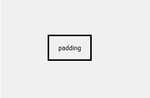
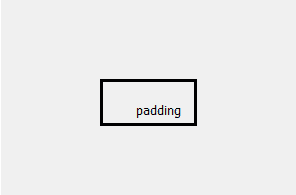
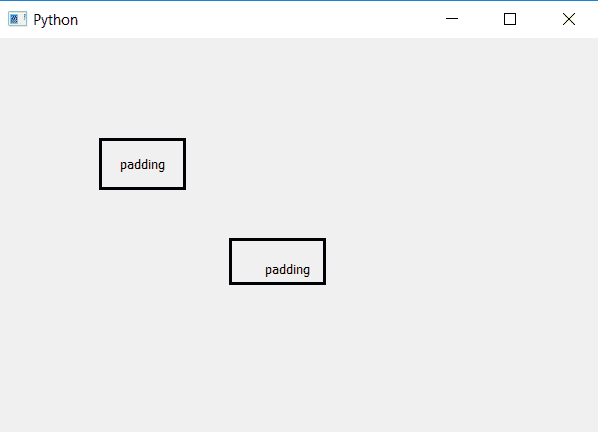

# pyqt 5–标签不同边缘的不同填充尺寸

> 原文:[https://www . geeksforgeeks . org/pyqt 5-标签边缘不同填充尺寸/](https://www.geeksforgeeks.org/pyqt5-different-padding-size-at-different-edge-of-label/)

在本文中，我们将看到如何在不同的边缘添加不同的填充大小。下图是正常填充的标签和不同边缘填充大小的标签。

 

为了做到这一点，我们将使用`setStyleSheet()`方法并描述每个边缘的填充长度。

> **语法:**
> 
> ```
> label.setStyleSheet("border :3px solid black;"
>                     "padding-top : 20px;"
>                     "padding-left:30px;"
>                     "padding-right:10;"
>                     "padding-bottom :5px;")
> 
> ```
> 
> **自变量:**它以字符串为自变量。
> 
> **执行的动作:**它将以各自的长度向各自的边缘添加填充。

**代码:**

```
# importing the required libraries

from PyQt5.QtCore import * 
from PyQt5.QtGui import * 
from PyQt5.QtWidgets import * 
import sys

class Window(QMainWindow):
    def __init__(self):
        super().__init__()

        # set the title
        self.setWindowTitle("Python")

        # setting  the geometry of window
        self.setGeometry(60, 60, 600, 400)

        # creating a label widget
        self.label_1 = QLabel("padding", self)

        # moving position
        self.label_1.move(100, 100)

        # setting up the border and padding
        self.label_1.setStyleSheet("border :3px solid black; 
                                              padding :15px")

        # resizing label
        self.label_1.adjustSize()

        # creating a label widget
        self.label_2 = QLabel("padding", self)

        # setting up the border 
        # and adding padding of different length to different edges
        self.label_2.setStyleSheet("border :3px solid black;"
                                   "padding-top : 20px;"
                                   "padding-left:30px;"
                                   "padding-right:10;"
                                   "padding-bottom :5px;")

        # moving position
        self.label_2.move(230, 200)

        # resizing the label
        self.label_2.adjustSize()

        # show all the widgets
        self.show()

# create pyqt5 app
App = QApplication(sys.argv)

# create the instance of our Window
window = Window()

# start the app
sys.exit(App.exec())
```

**输出:**
