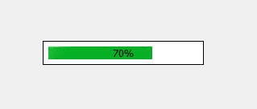
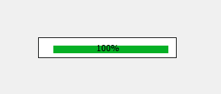
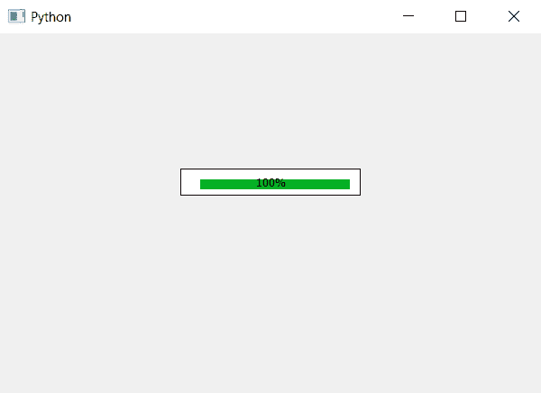

# PyQt5–不同大小的填充进度条

> 原文:[https://www . geeksforgeeks . org/pyqt 5-不同大小-填充-进度条/](https://www.geeksforgeeks.org/pyqt5-different-sized-padding-progress-bar/)

在本文中，我们将看到如何为进度条的不同边设置不同的填充大小，下面是普通填充进度条和不同大小填充进度条的表示。

 

为了做到这一点，我们必须改变进度条的 CSS 样式表，下面是样式表代码。

```
QProgressBar
{
border : 1px solid black;
padding-top : 10px;
padding-left: 20px;
padding-right:10;
padding-bottom : 5px;
}

```

下面是实现。

```
# importing libraries
from PyQt5.QtWidgets import * 
from PyQt5 import QtCore, QtGui
from PyQt5.QtGui import * 
from PyQt5.QtCore import * 
import sys

class Window(QMainWindow):

    def __init__(self):
        super().__init__()

        # setting title
        self.setWindowTitle("Python ")

        # setting geometry
        self.setGeometry(100, 100, 600, 400)

        # calling method
        self.UiComponents()

        # showing all the widgets
        self.show()

    # method for widgets
    def UiComponents(self):
        # creating progress bar
        bar = QProgressBar(self)

        # setting geometry to progress bar
        bar.setGeometry(200, 150, 200, 30)

        # set value to progress bar
        bar.setValue(100)

        # setting alignment to center
        bar.setAlignment(Qt.AlignCenter)

        # setting different padding size
        # and border to progress bar
        bar.setStyleSheet("QProgressBar"
                          "{"
                          "border : 1px solid black;"
                          "padding-top : 10px;"
                          "padding-left: 20px;"
                          "padding-right:10;"
                          "padding-bottom : 5px;"
                          "}")

# create pyqt5 app
App = QApplication(sys.argv)

# create the instance of our Window
window = Window()

# start the app
sys.exit(App.exec())
```

**输出:**
