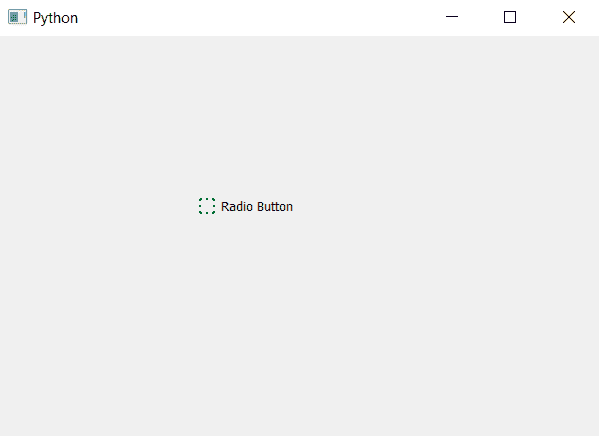

# PyQt5–单选按钮

中的虚线边框指示器

> 原文:[https://www . geesforgeks . org/pyqt 5-虚线边框-单选按钮中的指示器/](https://www.geeksforgeeks.org/pyqt5-dotted-border-indicator-in-radio-button/)

在本文中，我们将看到如何为单选按钮的指示器制作虚线边框。默认情况下，单选按钮指示器是圆形的，有实心黑色边框。

为了给单选按钮的指示器添加虚线边框，我们必须更改与单选按钮相关联的指示器的样式表代码，下面是样式表代码。

```py
QRadioButton::indicator
{
border : 2px blue;
border-style : dotted;
}

```

**注意:**当我们改变指示器样式表时，它会失去圆形。

下面是实现

```py
# importing libraries
from PyQt5.QtWidgets import * 
from PyQt5 import QtCore, QtGui
from PyQt5.QtGui import * 
from PyQt5.QtCore import * 
import sys

class Window(QMainWindow):

    def __init__(self):
        super().__init__()

        # setting title
        self.setWindowTitle("Python ")

        # setting geometry
        self.setGeometry(100, 100, 600, 400)

        # calling method
        self.UiComponents()

        # showing all the widgets
        self.show()

    # method for widgets
    def UiComponents(self):

        # creating a radio button
        radio_button = QRadioButton(self)

        # setting geometry of radio button
        radio_button.setGeometry(200, 150, 120, 40)

        # setting text to radio button
        radio_button.setText("Radio Button")

        # setting style sheet to radio button
        # setting border width and color to indicator
        # setting border style to dotted to indicator
        radio_button.setStyleSheet("QRadioButton::indicator"
                                   "{"
                                   "border : 2px green;"
                                   "border-style : dotted;"
                                   "}")

# create pyqt5 app
App = QApplication(sys.argv)

# create the instance of our Window
window = Window()

# start the app
sys.exit(App.exec())
```

**输出:**
