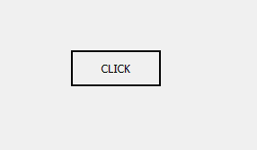
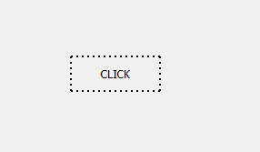
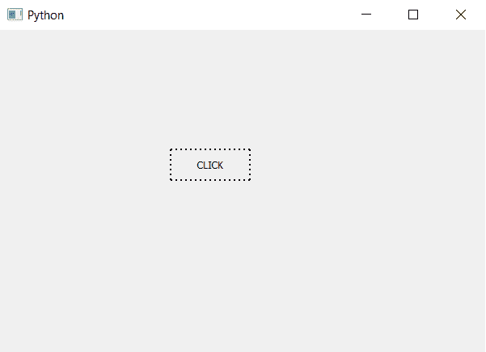

# PyQt5–按钮的虚线边框

> 原文:[https://www . geesforgeks . org/pyqt 5-点状按钮边框/](https://www.geeksforgeeks.org/pyqt5-dotted-border-of-push-button/)

在本文中，我们将看到如何创建按钮的虚线边框。下面是普通按钮和虚线边框的外观。

 

为了做到这一点，我们必须将边框样式从实线改为虚线，这可以使用样式表来完成。

> **语法:**button . set 样式表(“边框样式:虚线；”)
> 
> **自变量:**它以字符串为自变量。
> 
> **执行的动作:**将边框样式设置为虚线。

**代码:**

```py
# importing libraries
from PyQt5.QtWidgets import * 
from PyQt5.QtGui import * 
from PyQt5.QtCore import * 
import sys

class Window(QMainWindow):
    def __init__(self):
        super().__init__()

        # setting title
        self.setWindowTitle("Python ")

        # setting geometry
        self.setGeometry(100, 100, 600, 400)

        # calling method
        self.UiComponents()

        # showing all the widgets
        self.show()

    # method for widgets
    def UiComponents(self):

        # creating a push button
        button = QPushButton("CLICK", self)

        # setting geometry of button
        button.setGeometry(200, 150, 100, 40)

        # adding action to a button
        button.clicked.connect(self.clickme)

        # setting up border and border style to dotted
        button.setStyleSheet("border : 2px black; 
                              border-style : solid")

    # action method
    def clickme(self):

        # printing pressed
        print("pressed")

# create pyqt5 app
App = QApplication(sys.argv)

# create the instance of our Window
window = Window()

# start the app
sys.exit(App.exec())
```

**输出:**
