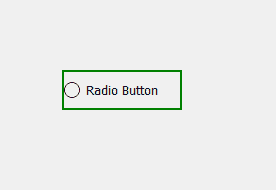
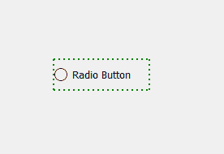
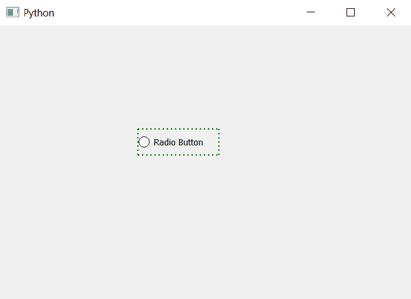

# PyQt5–单选按钮的虚线边框

> 原文:[https://www . geesforgeks . org/pyqt 5-单选按钮的虚线边框/](https://www.geeksforgeeks.org/pyqt5-dotted-border-of-radio-button/)

在本文中，我们将看到如何创建单选按钮的虚线边框。默认情况下，没有与单选按钮相关联的边框，尽管我们可以为它创建边框。我们也可以编辑样式表来制作点状边框。

下面是普通边框单选按钮与虚线边框单选按钮的图示。
 

为此，我们必须更改与单选按钮相关联的样式表。

```py
QRadioButton
{
border : 2px green;
border-style :dotted;
}

```

下面是实现。

```py
# importing libraries
from PyQt5.QtWidgets import *
from PyQt5 import QtCore, QtGui
from PyQt5.QtGui import *
from PyQt5.QtCore import *

import sys

class Window(QMainWindow):

    def __init__(self):
        super().__init__()

        # setting title
        self.setWindowTitle("Python ")

        # setting geometry
        self.setGeometry(100, 100, 600, 400)

        # calling method
        self.UiComponents()

        # showing all the widgets
        self.show()

    # method for widgets
    def UiComponents(self):

        # creating a radio button
        radio_button = QRadioButton(self)

        # setting geometry of radio button
        radio_button.setGeometry(200, 150, 120, 40)

        # setting text to radio button
        radio_button.setText("Radio Button")

        # setting style sheet to radio button
        # setting border width and color
        # setting border style to dotted
        radio_button.setStyleSheet("QRadioButton"
                                   "{"
                                   "border : 2px green;"
                                   "border-style : dotted;"
                                   "}")

# create pyqt5 app
App = QApplication(sys.argv)

# create the instance of our Window
window = Window()

# start the app
sys.exit(App.exec())
```

**输出:**
