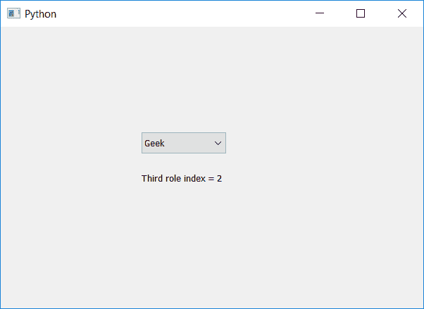

# pyqt 5–通过它们在组合框

中的角色查找项目

> 原文:[https://www . geeksforgeeks . org/pyqt 5-通过他们的角色查找项目组合框/](https://www.geeksforgeeks.org/pyqt5-finding-item-through-their-role-in-combobox/)

在本文中，我们将看到如何通过组合框中的角色找到项目，默认情况下，当我们创建组合框并向其中添加项目时，没有为项目设置角色。为了设置角色使用`setItemData`方法。

为了找到物品，我们将使用`findData`方法。

> **语法:**组合框.查找数据(角色)
> 
> **自变量:**以字符串为自变量，即角色
> 
> **返回:**返回给定角色的索引，如果角色不存在，返回-1

以下是实施–

```
# importing libraries
from PyQt5.QtWidgets import * 
from PyQt5 import QtCore, QtGui
from PyQt5.QtGui import * 
from PyQt5.QtCore import * 
import sys

class Window(QMainWindow):

    def __init__(self):
        super().__init__()

        # setting title
        self.setWindowTitle("Python ")

        # setting geometry
        self.setGeometry(100, 100, 600, 400)

        # calling method
        self.UiComponents()

        # showing all the widgets
        self.show()

    # method for widgets
    def UiComponents(self):

        # creating a combo box widget
        self.combo_box = QComboBox(self)

        # setting geometry of combo box
        self.combo_box.setGeometry(200, 150, 120, 30)

        # geek list
        geek_list = ["Geek", "Geeky Geek", "Legend Geek", "Ultra Legend Geek"]

        # adding list of items to combo box
        self.combo_box.addItems(geek_list)

        # setting roles to the items
        self.combo_box.setItemData(0, "First role")
        self.combo_box.setItemData(1, "Second role")
        self.combo_box.setItemData(2, "Third role")
        self.combo_box.setItemData(3, "Forth role")

        # finding item through role
        index = self.combo_box.findData("Third role")

        # creating label to show index
        label = QLabel("Third role index = " + str(index), self)

        # setting geometry of label
        label.setGeometry(200, 200, 200, 30)

# create pyqt5 app
App = QApplication(sys.argv)

# create the instance of our Window
window = Window()

# start the app
sys.exit(App.exec())
```

**输出:**
