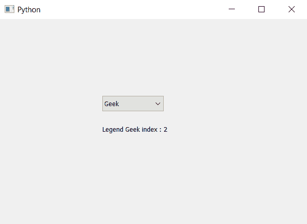

# PyQt5–通过组合框

中的文本查找项目

> 原文:[https://www . geeksforgeeks . org/pyqt 5-通过组合框中的文本查找项目/](https://www.geeksforgeeks.org/pyqt5-finding-the-item-through-text-in-combobox/)

在本文中，我们将看到如何借助其中的文本找到项目索引。我们知道可以借助`addItem`和`addItems`方法添加物品，以便借助`findText`方法找到物品。

> **语法:**组合框.查找文本(文本)
> 
> **自变量:**它以字符串为自变量。
> 
> **返回:**返回整数，即文本的索引，如果文本不存在，则返回-1

以下是实施–

```
# importing libraries
from PyQt5.QtWidgets import * 
from PyQt5 import QtCore, QtGui
from PyQt5.QtGui import * 
from PyQt5.QtCore import * 
import sys

class Window(QMainWindow):

    def __init__(self):
        super().__init__()

        # setting title
        self.setWindowTitle("Python ")

        # setting geometry
        self.setGeometry(100, 100, 600, 400)

        # calling method
        self.UiComponents()

        # showing all the widgets
        self.show()

    # method for widgets
    def UiComponents(self):

        # creating a combo box widget
        self.combo_box = QComboBox(self)

        # setting geometry of combo box
        self.combo_box.setGeometry(200, 150, 120, 30)

        # geek list
        geek_list = ["Geek", "Geeky Geek", "Legend Geek", "Ultra Legend Geek"]

        # adding list of items to combo box
        self.combo_box.addItems(geek_list)

        # text
        text = "Legend Geek"

        # finding index of text
        index = self.combo_box.findText(text)

        # label to show index
        label = QLabel(text + " index : " + str(index), self)

        # setting geometry of label
        label.setGeometry(200, 200, 200, 30)

# create pyqt5 app
App = QApplication(sys.argv)

# create the instance of our Window
window = Window()

# start the app
sys.exit(App.exec())
```

**输出:**
