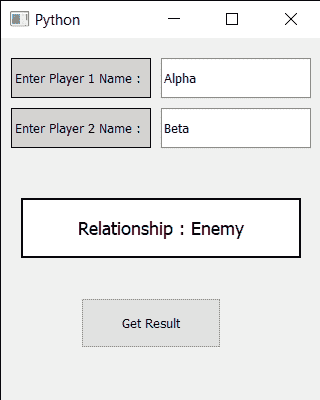

# PyQt5–火焰计算器

> 原文:[https://www.geeksforgeeks.org/pyqt5-flames-calculator/](https://www.geeksforgeeks.org/pyqt5-flames-calculator/)

在本文中，我们将看到如何使用 PyQt5 创建火焰计算器。这个火焰计算器基于两个给定名字的算法来评估和预测一段关系的结果。
**FLAMES** 是一款以首字母缩略词命名的热门游戏:朋友、恋人、深情、婚姻、敌人、兄弟姐妹。这个游戏不能准确预测一个人是否适合你，但是和你的朋友一起玩这个游戏会很有趣。
下面是火焰计算器的外观



> **GUI 实现步骤:**
> 1。创建一个标签，上面写着输入玩家 1 的名字，并为其设置颜色和几何图形
> 2。在名字标签前添加 QLineEdit 小部件，获得名字
> 3。同样，创建另一个标签，上面写着输入玩家 2 的名字，并为其设置颜色和几何图形
> 4。在这个标签前面添加 QLineEdit 小部件，得到第二个名字
> 5。创建一个标签来显示结果，并设置其边框、几何图形和更改其字体。
> 6。在底部创建一个按钮，上面写着获取结果。
> **后端实现步骤:**
> 1。向按钮
> 2 添加动作。在按钮动作里面获取两个玩家名字
> 3。去除名称之间的间距
> 4。调用返回结果的 get result 方法
> 5。在 get result 方法中，调用 remove letter 方法，该方法将删除常见字符及其各自的常见情况。
> 6。然后得到剩下的字符数，取 FLAMES 字母为[“F”、“L”、“A”、“M”、“E”、“S”]
> 7。用我们得到的计数开始移除字母。最后一个过程是结果的字母，返回结果
> 8。使用 setText 方法将结果设置为标签。

下面是实现

## 蟒蛇 3

```py
# importing libraries
from PyQt5.QtWidgets import *
from PyQt5 import QtCore, QtGui
from PyQt5.QtGui import *
from PyQt5.QtCore import *
import sys

class Window(QMainWindow):

    def __init__(self):
        super().__init__()

        # setting title
        self.setWindowTitle("Python ")

        # setting geometry
        self.setGeometry(100, 100, 320, 400)

        # calling method
        self.UiComponents()

        # showing all the widgets
        self.show()

    # method for components
    def UiComponents(self):

        # creating label to tell user enter first name
        name1_label = QLabel("Enter Player 1 Name : ", self)

        # setting border and color to the label
        name1_label.setStyleSheet("border : 1px solid black ;
                                    background : lightgrey;")

        # setting geometry
        name1_label.setGeometry(10, 20, 140, 40)

        # creating label to tell user enter second name
        name2_label = QLabel("Enter Player 2 Name : ", self)

        # setting border and color to the label
        name2_label.setStyleSheet("border : 1px solid black ;
                                     background : lightgrey;")

        # setting geometry
        name2_label.setGeometry(10, 70, 140, 40)

        # creating a line edit to get the first name
        self.name1 = QLineEdit(self)

        # setting geometry
        self.name1.setGeometry(160, 20, 150, 40)

        # creating a line edit to get the second name
        self.name2 = QLineEdit(self)

        # setting geometry
        self.name2.setGeometry(160, 70, 150, 40)

        # creating a label to show result
        self.output = QLabel("Find Relationship Status", self)

        # setting geometry to the output label
        self.output.setGeometry(20, 160, 280, 60)

        # setting border and background color to it
        self.output.setStyleSheet("border : 2px solid black;
                                       background : white;")

        # setting alignment to output
        self.output.setAlignment(Qt.AlignCenter)

        # setting font to the output
        self.output.setFont(QFont('Times', 11))

        # creating push button to get result
        self.push = QPushButton("Get Result", self)

        # setting geometry tot he button
        self.push.setGeometry(80, 260, 140, 50)

        # adding action to the push button
        self.push.clicked.connect(self.do_action)

    # action called by the push button
    def do_action(self):

        # getting names
        name1 = self.name1.text()
        name2 = self.name2.text()

        # removing spacing form the name
        name1.replace(" ", "")
        name2.replace(" ", "")

        # function for removing common characters
        # with their respective occurrences
        def remove_match_char(list1, list2):

            for i in range(len(list1)):
                for j in range(len(list2)):

                    # if common character is found
                    # then remove that character
                    # and return list of concatenated
                    # list with True Flag
                    if list1[i] == list2[j]:
                        c = list1[i]

                        # remove character from the list
                        list1.remove(c)
                        list2.remove(c)

                        # concatenation of two list elements with *
                        # * is act as border mark here
                        list3 = list1 + ["*"] + list2

                        # return the concatenated list with True flag
                        return [list3, True]

                        # no common characters is found
            # return the concatenated list with False flag
            list3 = list1 + ["*"] + list2
            return [list3, False]

        # method to find the result
        def find_relation(p1_list, p2_list):

            # taking a flag as True initially
            proceed = True

            # keep calling remove_match_char function
            # untill common characters is found or
            # keep looping untill proceed flag is True
            while proceed:
                # function calling and store return value
                ret_list = remove_match_char(p1_list, p2_list)

                # take out concatenated list from return list
                con_list = ret_list[0]

                # take out flag value from return list
                proceed = ret_list[1]

                # find the index of "*" / border mark
                star_index = con_list.index("*")

                # list slicing perform

                # all characters before * store in p1_list
                p1_list = con_list[: star_index]

                # all characters after * store in p2_list
                p2_list = con_list[star_index + 1:]

                # count total remaining characters
            count = len(p1_list) + len(p2_list)

            # list of FLAMES acronym
            result = ["Friends", "Love", "Affection", "Marriage", "Enemy", "Siblings"]

            # keep looping untill only one item
            # is not remaining in the result list
            while len(result) > 1:

                # store that index value from
                # where we have to perform slicing.
                split_index = (count % len(result) - 1)

                # this steps is done for performing
                # anticlock-wise circular fashion counting.
                if split_index >= 0:

                    # list slicing
                    right = result[split_index + 1:]
                    left = result[: split_index]

                    # list concatenation
                    result = right + left

                else:
                    result = result[: len(result) - 1]

            # print final result
            return result[0]

        # calling find relation method
        result = find_relation(list(name1), list(name2))

        # setting text to the output label
        self.output.setText("Relationship : " + result)

# create pyqt5 app
App = QApplication(sys.argv)

# create the instance of our Window
window = Window()

# start the app
sys.exit(App.exec())
```

**输出:**

<video class="wp-video-shortcode" id="video-429471-1" width="640" height="360" preload="metadata" controls=""><source type="video/mp4" src="https://media.geeksforgeeks.org/wp-content/uploads/20200601193628/Python-2020-06-01-19-35-57.mp4?_=1">[https://media.geeksforgeeks.org/wp-content/uploads/20200601193628/Python-2020-06-01-19-35-57.mp4](https://media.geeksforgeeks.org/wp-content/uploads/20200601193628/Python-2020-06-01-19-35-57.mp4)</video>