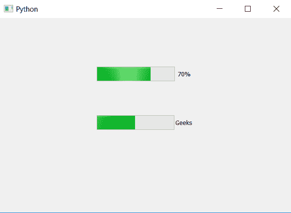

# PyQt5–进度条的格式()方法

> 原文:[https://www . geesforgeks . org/pyqt 5-format-method-for-progress-bar/](https://www.geeksforgeeks.org/pyqt5-format-method-for-progress-bar/)

我们可以使用进度条中的`setFormat`方法设置格式和显示文本，使用`format`方法获取进度条的格式。

**注意:**默认进度条的格式为“%p%”，即用来打印百分比，所以如果没有设置具体的格式`format`方法将返回“%p%”。

> **语法:** bar.format()
> 
> **论证:**不需要论证。
> 
> **返回:**返回字符串。

下面是这个方法的实现。

```py
# importing libraries
from PyQt5.QtWidgets import * 
from PyQt5 import QtCore, QtGui
from PyQt5.QtGui import * 
from PyQt5.QtCore import *
import sys

class Window(QMainWindow):

    def __init__(self):
        super().__init__()

        # setting title
        self.setWindowTitle("Python ")

        # setting geometry
        self.setGeometry(100, 100, 600, 400)

        # calling method
        self.UiComponents()

        # showing all the widgets
        self.show()

    # method for widgets
    def UiComponents(self):
        # creating progress bar
        bar1 = QProgressBar(self)

        # setting geometry to progress bar
        bar1.setGeometry(200, 100, 200, 30)

        # setting the value
        bar1.setValue(70)

        # getting format of bar1
        format1 = bar1.format()

        # printing the format1
        print("format of bar 1 : " + format1)

        bar2 = QProgressBar(self)

        # setting geometry to progress bar
        bar2.setGeometry(200, 200, 200, 30)

        # setting the value
        bar2.setValue(50)

        # setting text using format
        bar2.setFormat("Geeks")

        # getting format of bar2
        format2 = bar2.format()

        # printing the format2
        print("format of bar 2 : " + format2)

App = QApplication(sys.argv)

# create the instance of our Window
window = Window()

# start the app
sys.exit(App.exec())
```

**输出:**

```py
format of bar 1 : %p%
format of bar 2 : Geeks

```

