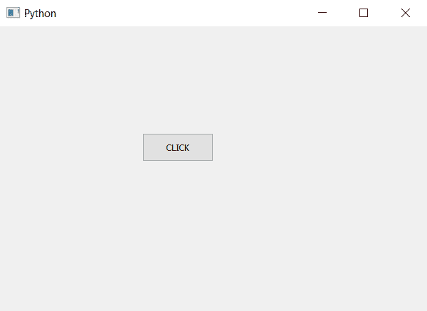

# PyQt5–获取按钮的几何图形

> 原文:[https://www . geeksforgeeks . org/pyqt 5-获取按钮几何图形/](https://www.geeksforgeeks.org/pyqt5-get-geometry-of-the-push-button/)

我们知道可以使用`setGeometry`方法设置按钮的几何形状，PyQt5 中的几何形状是指按钮的位置和大小。

为了获得任何按钮的几何形状，我们将使用`geometry`方法。这个方法将返回`QRect object`，它告诉按钮的位置和大小，这也是`setGeometry`方法的论点。

> **语法:** button.geometry()
> 
> **论证:**不需要论证。
> 
> **返回**返回 QRect 对象。

**代码:**

```py
# importing libraries
from PyQt5.QtWidgets import * 
from PyQt5.QtGui import * 
from PyQt5.QtCore import * 
import sys

class Window(QMainWindow):
    def __init__(self):
        super().__init__()

        # setting title
        self.setWindowTitle("Python ")

        # setting geometry
        self.setGeometry(100, 100, 600, 400)

        # calling method
        self.UiComponents()

        # showing all the widgets
        self.show()

    # method for widgets
    def UiComponents(self):

        # creating a push button
        button = QPushButton("CLICK", self)

        # setting geometry of button
        button.setGeometry(200, 150, 100, 40)

        # adding action to a button
        button.clicked.connect(self.clickme)

        # getting geometry
        geo = button.geometry()

        # printing the geometry
        print(geo)

    # action method
    def clickme(self):

        # printing pressed
        print("pressed")

# create pyqt5 app
App = QApplication(sys.argv)

# create the instance of our Window
window = Window()

# start the app
sys.exit(App.exec())
```

**输出:**

```py
PyQt5.QtCore.QRect(200, 150, 100, 40)
```

