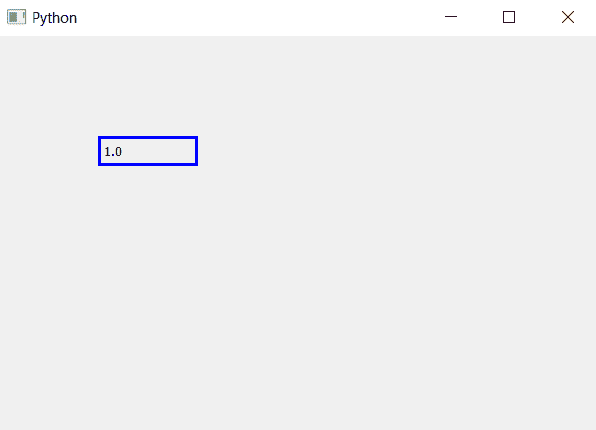
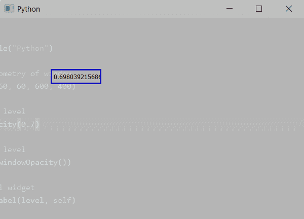

# PyQt5–获取主窗口的不透明度级别| windowOpacity()方法

> 原文:[https://www . geesforgeks . org/pyqt5-get-不透明度-主窗口级别-window 不透明度-方法/](https://www.geeksforgeeks.org/pyqt5-get-opacity-level-of-the-main-window-windowopacity-method/)

`windowOpacity()`方法允许我们查看主窗口的不透明度级别。**不透明度**是对电磁或其他类型辐射，尤其是可见光不可透过性的度量。在辐射传输中，它描述了辐射在介质中的吸收和散射，如等离子体、电介质、屏蔽材料、玻璃等。

不透明度级别范围从 0.0 到 1.0，其中 0.0 表示完全透明，1.0 表示完全不透明，默认情况下是 1.0，即完全不透明。

> **语法 ：** self.window 不透明度（）
> 
> **论证:**不需要论证。
> 
> **返回:**返回一个从 0.0 到 1.0 的浮点值

**例 1:**

```
# importing the required libraries

from PyQt5.QtCore import * 
from PyQt5.QtGui import * 
from PyQt5.QtWidgets import * 
import sys

class Window(QMainWindow):

    def __init__(self):
        super().__init__()

        # set the title
        self.setWindowTitle("Python")

        # setting  the geometry of window
        self.setGeometry(60, 60, 600, 400)

        # getting opacity level
        level = str(self.windowOpacity())

        # creating a label widget
        self.label_1 = QLabel(level, self)

        # moving position
        self.label_1.move(100, 100)

        # setting up the border
        self.label_1.setStyleSheet("border :3px solid blue;")

        # show all the widgets
        self.show()

# create pyqt5 app
App = QApplication(sys.argv)

# create the instance of our Window
window = Window()
# start the app
sys.exit(App.exec())
```

**输出:**


**例 2:**

```
# importing the required libraries

from PyQt5.QtCore import * 
from PyQt5.QtGui import * 
from PyQt5.QtWidgets import * 
import sys

class Window(QMainWindow):

    def __init__(self):
        super().__init__()

        # set the title
        self.setWindowTitle("Python")

        # setting  the geometry of window
        self.setGeometry(60, 60, 600, 400)

        # setting opacity level
        self.setWindowOpacity(0.7)

        # getting opacity level
        level = str(self.windowOpacity())

        # creating a label widget
        self.label_1 = QLabel(level, self)
        # moving position
        self.label_1.move(100, 100)

        # setting up the border
        self.label_1.setStyleSheet("border :3px solid blue;")

        # show all the widgets
        self.show()

# create pyqt5 app
App = QApplication(sys.argv)

# create the instance of our Window
window = Window()
# start the app
sys.exit(App.exec())
```

**输出:**
