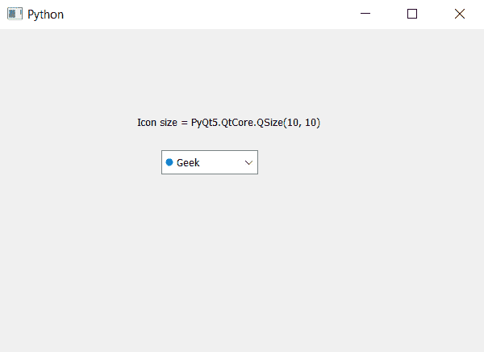

# PyQt5–获取组合框

中项目图标的图标大小

> 原文:[https://www . geeksforgeeks . org/pyqt5-获取图标大小的项目图标组合框/](https://www.geeksforgeeks.org/pyqt5-get-the-icon-size-of-item-icon-in-combobox/)

在本文中，我们将看到如何获得组合框项目的图标大小。虽然我们可以借助`setItemIcon`方法为每个项目设置图标，但默认情况下，组合框中没有图标设置。有些时候需要调整图标大小，为了改变物品图标的图标大小我们会采用`setIconSize`的方法。

> **语法:** combobox.iconSize()
> 
> **论证:**不需要论证
> 
> **返回:**将返回 QSize 对象

以下是实施–

```py
# importing libraries
from PyQt5.QtWidgets import * 
from PyQt5 import QtCore, QtGui
from PyQt5.QtGui import * 
from PyQt5.QtCore import * 
import sys

class Window(QMainWindow):

    def __init__(self):
        super().__init__()

        # setting title
        self.setWindowTitle("Python ")

        # setting geometry
        self.setGeometry(100, 100, 600, 400)

        # calling method
        self.UiComponents()

        # showing all the widgets
        self.show()

    # method for widgets
    def UiComponents(self):

        # creating a combo box widget
        self.combo_box = QComboBox(self)

        # setting geometry of combo box
        self.combo_box.setGeometry(200, 150, 120, 30)

        # geek list
        geek_list = ["Geek", "Geeky Geek"]

        # adding list of items to combo box
        self.combo_box.addItems(geek_list)

        # creating editable combo box
        self.combo_box.setEditable(True)

        # index
        index = 0

        # icon
        icon = QIcon('logo.png')

        # adding icon to the given index
        self.combo_box.setItemIcon(index, icon)

        # setting icon size
        self.combo_box.setIconSize(QSize(10, 10))

        # getting size
        size = self.combo_box.iconSize()

        # creating label to show the size
        label = QLabel("Icon size = " + str(size), self)

        # setting geometry to the label
        label.setGeometry(170, 100, 300, 30)

# create pyqt5 app
App = QApplication(sys.argv)

# create the instance of our Window
window = Window()

# start the app
sys.exit(App.exec())
```

**输出:**
