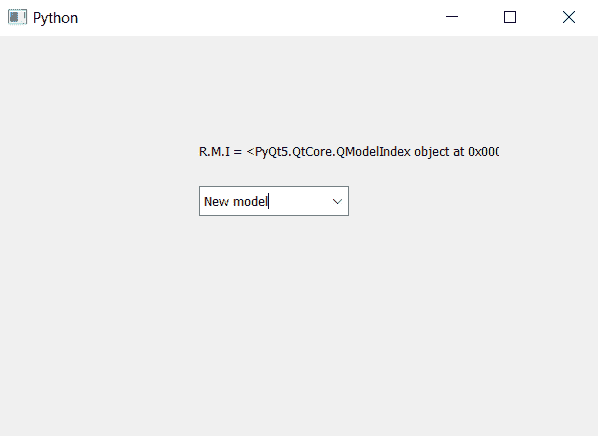

# PyQt5–获取 ComboBox 的根模型索引

> 原文:[https://www . geesforgeks . org/pyqt5-get-the-root-model-index-of-combobox/](https://www.geeksforgeeks.org/pyqt5-get-the-root-model-index-of-combobox/)

在本文中，我们将看到如何获得组合框的根模型索引。根模型索引可以借助`setRootModelIndex`方法进行设置/更改，这为组合框的项目设置了根模型索引，为了得到根模型索引我们使用`rootModelIndex`方法。

> **语法:**组合框 _ rootmodelindex()
> 
> **论证:**不需要论证
> 
> **返回:**返回 QModelIndex 对象

以下是实施–

```py
# importing libraries
from PyQt5.QtWidgets import * 
from PyQt5 import QtCore, QtGui
from PyQt5.QtGui import * 
from PyQt5.QtCore import * 
import sys

class Window(QMainWindow):

    def __init__(self):
        super().__init__()

        # setting title
        self.setWindowTitle("Python ")

        # setting geometry
        self.setGeometry(100, 100, 600, 400)

        # calling method
        self.UiComponents()

        # showing all the widgets
        self.show()

    # method for widgets
    def UiComponents(self):

        # creating a combo box widget
        self.combo_box = QComboBox(self)

        # setting geometry of combo box
        self.combo_box.setGeometry(200, 150, 150, 30)
        # creating a model
        model = QtGui.QStandardItemModel(0, 1)

        # creating a item
        item = QtGui.QStandardItem("New model")

        # adding item to the model
        model.appendRow(item)

        # setting model to the combo box
        self.combo_box.setModel(model)

        # geek list
        geek_list = ["Sayian", "Super Saiyan", "Super Sayian 2",
                                               "Super Sayian B"]

        # making it editable
        self.combo_box.setEditable(True)

        # adding list of items to combo box
        self.combo_box.addItems(geek_list)

        # getting root model index
        root_index = self.combo_box.rootModelIndex()

        # creating label to show root model index
        label = QLabel("R.M.I = " + str(root_index), self)

        # setting geometry to the label
        label.setGeometry(200, 100, 300, 30)

# create pyqt5 app
App = QApplication(sys.argv)

# create the instance of our Window
window = Window()

# start the app
sys.exit(App.exec())
```

**输出:**
