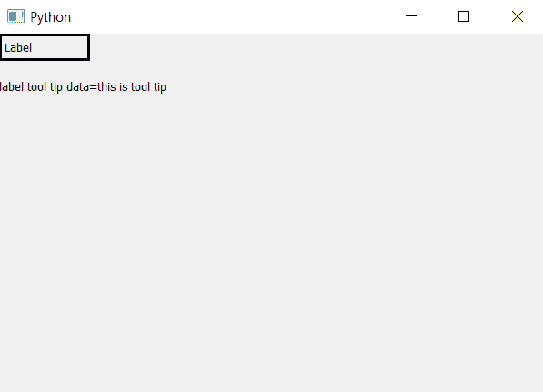

# PyQt5–获取标签的工具提示数据|工具提示()方法

> 原文:[https://www . geesforgeks . org/pyqt5-get-tooltip-data-of-label-tooltip-method/](https://www.geeksforgeeks.org/pyqt5-get-tooltip-data-of-label-tooltip-method/)

PyQt5 提供用户使用`setToolTip()`方法创建工具提示。在本文中，我们将看到如何访问工具提示的内容。为了做到这一点，我们将使用`toolTip()`方法。

> **语法:** label.toolTip
> 
> **论证:**不需要论证。
> 
> **返回:**返回字符串。

**代码:**

```py
# importing the required libraries

from PyQt5.QtCore import * 
from PyQt5.QtGui import * 
from PyQt5.QtWidgets import * 
import sys

class Window(QMainWindow):
    def __init__(self):
        super().__init__()

        # set the title
        self.setWindowTitle("Python")

        # setting geometry
        self.setGeometry(100, 100, 600, 400)
        # creating a label widget
        self.label_1 = QLabel("Label", self)

        # moving position
        self.label_1.move(0, 0)

        # setting up the border
        self.label_1.setStyleSheet("border :3px solid black;")

        # setting label tool tip
        self.label_1.setToolTip("this is tool tip")

        # setting time duration
        self.label_1.setToolTipDuration(500)

        # getting tool tip content
        data = self.label_1.toolTip()

        # creating a label widget
        self.label_2 = QLabel("label tool tip data =" +
                                            data, self)

        # moving position
        self.label_2.move(0, 50)

        # adjust size
        self.label_2.adjustSize()

        # show all the widgets
        self.show()

# create pyqt5 app
App = QApplication(sys.argv)

# create the instance of our Window
window = Window()

# start the app
sys.exit(App.exec())
```

**输出:**
