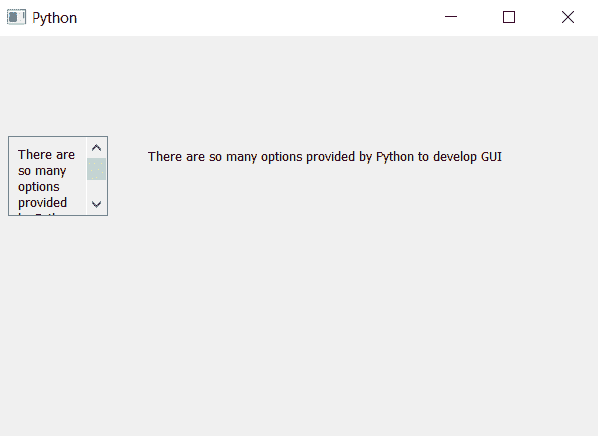

# PyQt5–获取可滚动标签的文本

> 原文:[https://www . geeksforgeeks . org/pyqt 5-获取可滚动标签文本/](https://www.geeksforgeeks.org/pyqt5-getting-text-of-scrollable-label/)

在这篇文章中，我们将看到我们如何能够获得可滚动标签的文本，我们可以创建一个可滚动标签的帮助下，使新的类继承滚动区域类，但问题出现了，新的类只能设置文本，我们不能获得文本，因为它是可滚动标签类对象，而不是正常的标签对象。

> 要从可滚动标签中检索文本，请执行以下操作–
> 
> 1.创建一个可滚动的标签类，继承 QScrollArea
> 2。添加布局并将标签添加到标签
> 3。设置文本功能，为标签添加文本
> 4。创建一个返回标签内容的文本函数

**滚动标签类语法:**

```
class ScrollLabel(QScrollArea):

    # constructor
    def __init__(self, *args, **kwargs):
        QScrollArea.__init__(self, *args, **kwargs)

        # making widget resizable
        self.setWidgetResizable(True)

        # making qwidget object
        content = QWidget(self)
        self.setWidget(content)

        # vertical box layout
        lay = QVBoxLayout(content)

        # creating label
        self.label = QLabel(content)

        # setting alignment to the text
        self.label.setAlignment(Qt.AlignLeft | Qt.AlignTop)

        # making label multi-line
        self.label.setWordWrap(True)

        # adding label to the layout
        lay.addWidget(self.label)

    # the setText method
    def setText(self, text):
        # setting text to the label
        self.label.setText(text)

    # getting text method
    def text(self):

        # getting text of the label
        get_text = self.label.text()

        # return the text
        return get_text

```

下面是实现

```
# importing libraries
from PyQt5.QtWidgets import * 
from PyQt5 import QtCore, QtGui
from PyQt5.QtGui import * 
from PyQt5.QtCore import * 
import sys

# class for scrollable label
class ScrollLabel(QScrollArea):

    # constructor
    def __init__(self, *args, **kwargs):
        QScrollArea.__init__(self, *args, **kwargs)

        # making widget resizable
        self.setWidgetResizable(True)

        # making qwidget object
        content = QWidget(self)
        self.setWidget(content)

        # vertical box layout
        lay = QVBoxLayout(content)

        # creating label
        self.label = QLabel(content)

        # setting alignment to the text
        self.label.setAlignment(Qt.AlignLeft | Qt.AlignTop)

        # making label multi-line
        self.label.setWordWrap(True)

        # adding label to the layout
        lay.addWidget(self.label)

    # the setText method
    def setText(self, text):
        # setting text to the label
        self.label.setText(text)

    # getting text method
    def text(self):

        # getting text of the label
        get_text = self.label.text()

        # return the text
        return get_text

class Window(QMainWindow):

    def __init__(self):
        super().__init__()

        # setting title
        self.setWindowTitle("Python ")

        # setting geometry
        self.setGeometry(100, 100, 600, 400)

        # calling method
        self.UiComponents()

        # showing all the widgets
        self.show()

    # method for widgets
    def UiComponents(self):
        # text to show in label
        text = "There are so many options provided by Python to develop GUI "

        # creating scroll label
        label = ScrollLabel(self)

        # setting text to the label
        label.setText(text)

        # setting geometry
        label.setGeometry(10, 100, 100, 80)

        get_text = label.text()

        # creating another label to show the text
        result = QLabel(get_text, self)

        # setting geometry to the label
        result.setGeometry(150, 100, 400, 40)

# create pyqt5 app
App = QApplication(sys.argv)

# create the instance of our Window
window = Window()

window.show()

# start the app
sys.exit(App.exec())
```

**输出:**
