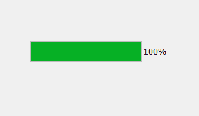
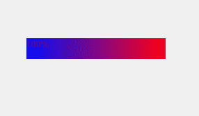
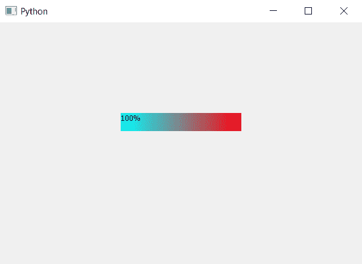

# PyQt5–进度条的渐变颜色条

> 原文:[https://www . geesforgeks . org/pyqt 5-渐变-颜色-进度条/](https://www.geeksforgeeks.org/pyqt5-gradient-color-bar-of-progress-bar/)

在这篇文章中，我们将看到如何创建渐变颜色的过程吧。

**渐变颜色:**在计算机图形学中，颜色渐变指定一系列位置相关的颜色，通常用于填充区域。例如，许多窗口管理器允许将屏幕背景指定为渐变。渐变产生的颜色随位置连续变化，产生平滑的颜色过渡。

下面是进度条的普通条与进度条的渐变颜色条的外观:

 

**样式表代码:**

```
QProgressBar::chunk 
{
background: QLinearGradient( x1: 0, y1: 0,
                             x2: 1, y2: 0, 
                            stop: 0 #000fff,
                            stop: 1 #ff000f );
}

```

这个样式表是借助`setStyleSheet`方法使用的。

```
# importing libraries
from PyQt5.QtWidgets import * 
from PyQt5 import QtCore, QtGui
from PyQt5.QtGui import * 
from PyQt5.QtCore import * 
import sys

class Window(QMainWindow):

    def __init__(self):
        super().__init__()

        # setting title
        self.setWindowTitle("Python ")

        # setting geometry
        self.setGeometry(100, 100, 600, 400)

        # calling method
        self.UiComponents()

        # showing all the widgets
        self.show()

    # method for widgets
    def UiComponents(self):

        # creating progress bar
        bar = QProgressBar(self)

        # setting geometry to progress bar
        bar.setGeometry(200, 150, 200, 30)

        # set value to progress bar
        bar.setValue(100)

        # setting gradient color to bar
        bar.setStyleSheet("QProgressBar::chunk "
                          "{"
                          "background: QLinearGradient( x1: 0, y1: 0, 
                                                        x2: 1, y2: 0, 
                                                    stop: 0 # 00ffff, 
                                                   stop: 1 # ff000f );"
                          "}")

# create pyqt5 app
App = QApplication(sys.argv)

# create the instance of our Window
window = Window()

# start the app
sys.exit(App.exec())
```

**输出:**
