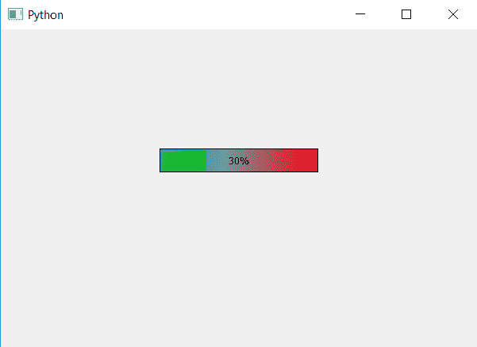

# PyQt5–渐变颜色进度条

> 原文:[https://www . geesforgeks . org/pyqt 5-渐变-颜色-进度条/](https://www.geeksforgeeks.org/pyqt5-gradient-color-progress-bar/)

在本文中，我们将看到如何设置进度条的渐变颜色。下面是普通颜色进度条的外观与渐变颜色进度条的外观。
 

为了做到这一点，我们必须改变 CSS 样式表，下面是样式表的代码。

```
QProgressBar::chunk 
{
border : 1px solid black;
background: QLinearGradient( x1: 0, y1: 0,
                             x2: 1, y2: 0, 
                          stop: 0 #000fff, 
                          stop: 1 #ff000f );
}

```

下面是实现。

```
# importing libraries
from PyQt5.QtWidgets import * 
from PyQt5 import QtCore, QtGui
from PyQt5.QtGui import * 
from PyQt5.QtCore import * 
import sys

class Window(QMainWindow):

    def __init__(self):
        super().__init__()

        # setting title
        self.setWindowTitle("Python ")

        # setting geometry
        self.setGeometry(100, 100, 600, 400)

        # calling method
        self.UiComponents()

        # showing all the widgets
        self.show()

    # method for widgets
    def UiComponents(self):
        # creating progress bar
        bar = QProgressBar(self)

        # setting geometry to progress bar
        bar.setGeometry(200, 150, 200, 30)

        # set value to progress bar
        bar.setValue(30)

        # setting alignment to center
        bar.setAlignment(Qt.AlignCenter)

        # setting gradient color to progress bar
        bar.setStyleSheet("QProgressBar"
                          "{"
                          "border : 1px solid black;"
                          "background: QLinearGradient( x1: 0, y1: 0,
                                                        x2: 1, y2: 0,
                                                    stop: 0 # 00ffff,
                                                    stop: 1 # ff000f );"
                          "}")

# create pyqt5 app
App = QApplication(sys.argv)

# create the instance of our Window
window = Window()

# start the app
sys.exit(App.exec())
```

**输出:**
