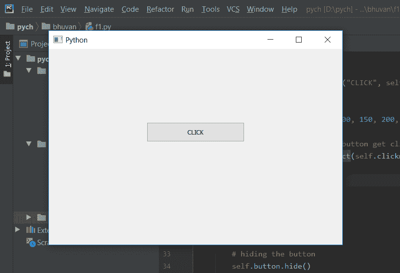
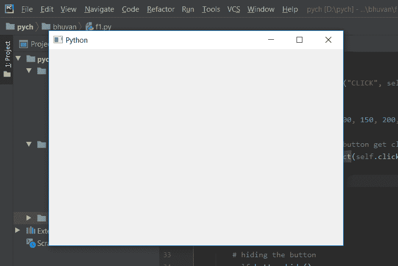

# PyQt5–点击

隐藏按钮

> 原文:[https://www . geesforgeks . org/pyqt 5-隐藏-按钮-点击/](https://www.geeksforgeeks.org/pyqt5-hide-push-button-on-click/)

在本文中，我们将看到如何隐藏按钮。当我们设计图形用户界面时，我们会在其中创建按钮，当按钮被按下时，它们会执行一些任务。但是有些时候他们是需要隐藏按钮的如果任务完成了，为了隐藏按钮我们会使用隐藏的方法。

> **语法:** button.hide()
> **参数:**不需要参数。
> **执行的动作:**隐藏按钮

**代码:**

## 蟒蛇 3

```
# importing libraries
from PyQt5.QtWidgets import *
from PyQt5.QtGui import *
from PyQt5.QtCore import *
import sys

class Window(QMainWindow):
    def __init__(self):
        super().__init__()

        # setting title
        self.setWindowTitle("Python ")

        # setting geometry
        self.setGeometry(100, 100, 600, 400)

        # creating a button
        self.button = QPushButton("CLICK", self)

        # setting up the geometry
        self.button.setGeometry(200, 150, 200, 40)

        # connecting method when button get clicked
        self.button.clicked.connect(self.clickme)

        # showing all the widgets
        self.show()

    # action method
    def clickme(self):

        # hiding the button
        self.button.hide()
        # printing pressed
        print("pressed")

# create pyqt5 app
App = QApplication(sys.argv)

# create the instance of our Window
window = Window()

# start the app
sys.exit(App.exec())
```

**输出:**



当点击按钮时，将产生输出，按钮将被隐藏。

```
pressed 
```

