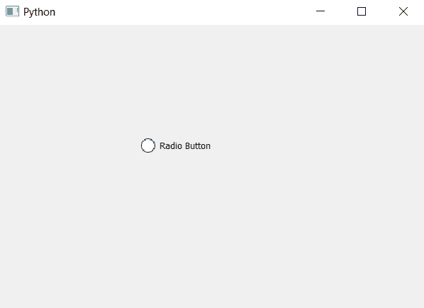

# pyqt 5–如何更改单选按钮

中指示器的大小

> 原文:[https://www . geesforgeks . org/pyqt 5-如何更改单选按钮中指示器的大小/](https://www.geeksforgeeks.org/pyqt5-how-change-size-of-indicator-in-radio-button/)

在本文中，我们将看到如何改变单选按钮中指示器的大小，指示器是单选按钮的一部分，它的形状是圆形的，并告知单选按钮是否被选中。当我们改变单选按钮的大小时，只有文本部分的大小得到改变，指示器的大小保持不变。

为了改变单选按钮中指示器的大小，我们必须改变与单选按钮对象相关的样式表代码。下面是样式表代码。

```
QRadioButton::indicator
{
width : 20px;
height : 20px;
}

```

下面是实现。

```
# importing libraries
from PyQt5.QtWidgets import * 
from PyQt5 import QtCore, QtGui
from PyQt5.QtGui import * 
from PyQt5.QtCore import * 
import sys

class Window(QMainWindow):

    def __init__(self):
        super().__init__()

        # setting title
        self.setWindowTitle("Python ")

        # setting geometry
        self.setGeometry(100, 100, 600, 400)

        # calling method
        self.UiComponents()

        # showing all the widgets
        self.show()

    # method for widgets
    def UiComponents(self):

        # creating a radio button
        self.radio_button = QRadioButton(self)

        # setting geometry of radio button
        self.radio_button.setGeometry(200, 150, 120, 40)

        # setting text to radio button
        self.radio_button.setText("Radio Button")

        # changing style sheet code of radio button
        # setting width and height of indicator 
        self.radio_button.setStyleSheet("QRadioButton::indicator"
                                        "{"
                                        "width : 20px;"
                                        "height : 20px;"
                                        "}")

# create pyqt5 app
App = QApplication(sys.argv)

# create the instance of our Window
window = Window()

# start the app
sys.exit(App.exec())
```

**输出:**
