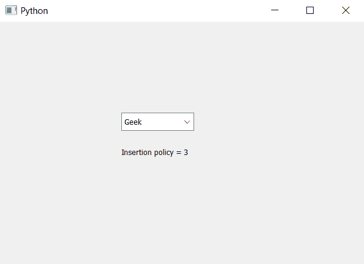

# PyQt5–如何了解组合框的插入策略

> 原文:[https://www . geeksforgeeks . org/pyqt 5-技术诀窍-插入策略-组合框/](https://www.geeksforgeeks.org/pyqt5-how-know-the-insertion-policy-of-the-combobox/)

在本文中，我们将了解如何知道组合框的插入策略。默认情况下，它插入底部，尽管我们可以随时更改它。插入策略告诉用户插入的新项目将存储在哪里。

为了知道插入策略，我们使用`insertPolicy`方法。

> **语法:**组合框.插入策略()
> 
> **论证:**不需要论证
> 
> **返回:**返回 InsertPolicy 对象(在底部打印 3 个用于插入)

下面是实现

```
# importing libraries
from PyQt5.QtWidgets import * 
from PyQt5 import QtCore, QtGui
from PyQt5.QtGui import * 
from PyQt5.QtCore import * 
import sys

class Window(QMainWindow):

    def __init__(self):
        super().__init__()

        # setting title
        self.setWindowTitle("Python ")

        # setting geometry
        self.setGeometry(100, 100, 600, 400)

        # calling method
        self.UiComponents()

        # showing all the widgets
        self.show()

    # method for widgets
    def UiComponents(self):

        # creating a combo box widget
        self.combo_box = QComboBox(self)

        # setting geometry of combo box
        self.combo_box.setGeometry(200, 150, 120, 30)

        # geek list
        geek_list = ["Geek", "Geeky Geek", "Legend Geek", "Ultra Legend Geek"]

        # adding list of items to combo box
        self.combo_box.addItems(geek_list)

        # creating editable combo box
        self.combo_box.setEditable(True)

        # getting current insertion policy
        policy = self.combo_box.insertPolicy()

        # creating label to  print the policy
        label = QLabel("Insertion policy = " + str(policy), self)

        # setting geometry of the label
        label.setGeometry(200, 200, 200, 30)

# create pyqt5 app
App = QApplication(sys.argv)

# create the instance of our Window
window = Window()

# start the app
sys.exit(App.exec())
```

**输出:**
