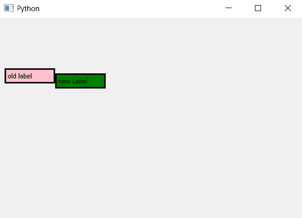

# pyqt 5–如何访问标签的内容？

> 原文:[https://www . geesforgeks . org/pyqt 5-如何访问标签内容/](https://www.geeksforgeeks.org/pyqt5-how-to-access-content-of-label/)

我们可以使用`QLabel()`方法创建标签，使用`setText()`方法设置内容。在本文中，我们将看到如何访问标签的内容，为了做到这一点我们将使用`text()`方法。

> **语法:** label.text()
> 
> **论证:**不需要论证。
> 
> **返回:**返回一个字符串。

**代码:**

```
# importing the required libraries

from PyQt5.QtCore import * 
from PyQt5.QtGui import * 
from PyQt5.QtWidgets import * 
import sys

class Window(QMainWindow):
    def __init__(self):
        super().__init__()

        # set the title
        self.setWindowTitle("Python")

        # setting geometry
        self.setGeometry(100, 100, 600, 400)

        # creating a label widget
        self.label_1 = QLabel("old label ", self)

        # setting up the border and background color
        self.label_1.setStyleSheet("border :3px solid black; 
                                    background : pink")

        # getting the content of label
        content = self.label_1.text()

        # printing the content of label
        print(content)

        # moving the label
        self.label_1.move(10, 100)

        # creating a new label widget
        self.label_2 = QLabel("new Label ", self)

        # setting up the border and background color
        self.label_2.setStyleSheet("border :3px solid black; 
                                    background : green")

        # moving the label
        self.label_2.move(110, 110)

        # printing the content of label
        print(self.label_2.text())

        # show all the widgets
        self.show()

# create pyqt5 app
App = QApplication(sys.argv)

# create the instance of our Window
window = Window()

# start the app
sys.exit(App.exec())
```

**输出:**

```
old label 
new Label 

```

