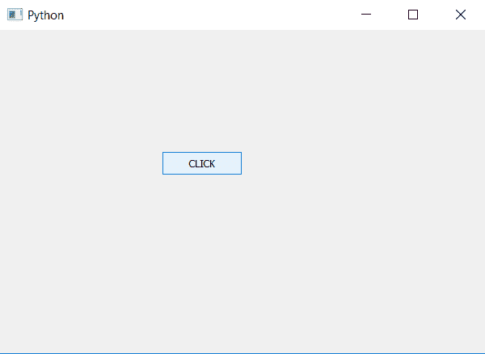

# pyqt 5–如何给按钮添加动作？

> 原文:[https://www . geesforgeks . org/pyqt 5-如何将动作添加到按钮/](https://www.geeksforgeeks.org/pyqt5-how-to-add-action-to-a-button/)

在本文中，我们将看到如何设置按钮的动作。`QPushButton`是 PyQt 中的一个简单按钮，当用户点击时，会执行一些相关的动作。要将此按钮添加到应用程序中，请使用`QPushButton class`。

当按钮被按下时，它应该执行一些动作，为了给按钮添加动作，我们将使用`clicked.connect`方法。

> **语法:**按钮. clicked.connect(函数)
> 
> **自变量:**它以函数作为自变量。
> 
> **执行的操作:**当按钮被点击时，它将调用传递函数。

**代码:**

```
# importing libraries
from PyQt5.QtWidgets import * 
from PyQt5.QtGui import * 
from PyQt5.QtCore import * 
import sys

class Window(QMainWindow):
    def __init__(self):
        super().__init__()

        # setting title
        self.setWindowTitle("Python ")

        # setting geometry
        self.setGeometry(100, 100, 600, 400)

        # calling method
        self.UiComponents()

        # showing all the widgets
        self.show()

    # method for widgets
    def UiComponents(self):

        # creating a push button
        button = QPushButton("CLICK", self)

        # setting geometry of button
        button.setGeometry(200, 150, 100, 30)

        # adding action to a button
        button.clicked.connect(self.clickme)

    # action method
    def clickme(self):

        # printing pressed
        print("pressed")

# create pyqt5 app
App = QApplication(sys.argv)

# create the instance of our Window
window = Window()

# start the app
sys.exit(App.exec())
```

**输出:**

当我们点击按钮时。

```
pressed
```