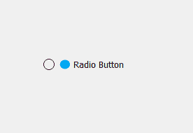
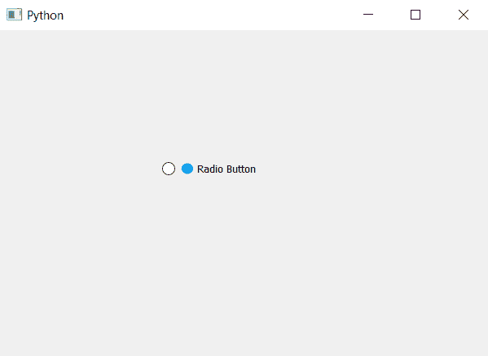

# PyQt5–如何给单选按钮添加图标？

> 原文:[https://www . geesforgeks . org/pyqt 5-如何将图标添加到单选按钮/](https://www.geeksforgeeks.org/pyqt5-how-to-add-icon-to-radio-button/)

在本文中，我们将了解如何将徽标设置为单选按钮。默认情况下，单选按钮没有徽标设置，虽然我们可以将图标设置为单选按钮，但它类似于将图标设置为主窗口，但与主窗口不同，单选按钮的图标出现在指示器和文本部分之间。

下面是默认单选按钮的外观与带有图标的单选按钮的外观。
 

> **为了给单选按钮添加图标，我们必须执行以下操作:**
> 
> 1.创建单选按钮。
> 2。加载图标，借助`QIcon`类
> 3 创建对象。借助`setIcon`方法将 QIcon 的对象设置为单选按钮的图标。

下面是实现。

```py
# importing libraries
from PyQt5.QtWidgets import * 
from PyQt5 import QtCore, QtGui
from PyQt5.QtGui import * 
from PyQt5.QtCore import * 
import sys

class Window(QMainWindow):

    def __init__(self):
        super().__init__()

        # setting title
        self.setWindowTitle("Python ")

        # setting geometry
        self.setGeometry(100, 100, 600, 400)

        # calling method
        self.UiComponents()

        # showing all the widgets
        self.show()

    # method for widgets
    def UiComponents(self):

        # creating a radio button
        radio_button = QRadioButton(self)

        # setting geometry of radio button
        radio_button.setGeometry(200, 150, 120, 40)

        # setting text to radio button
        radio_button.setText("Radio Button")

        # creating object of QICon and loading the icon
        icon = QIcon('logo.png')

        # setting icon to radio button
        radio_button.setIcon(icon)

# create pyqt5 app
App = QApplication(sys.argv)

# create the instance of our Window
window = Window()

# start the app
sys.exit(App.exec())
```

**输出:**
