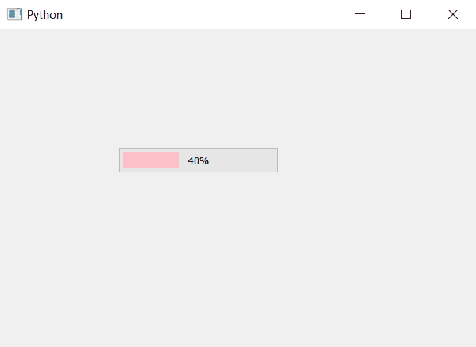

# PyQt5–如何在进度条

中添加边距

> 原文:[https://www . geesforgeks . org/pyqt 5-如何添加进度条边距/](https://www.geeksforgeeks.org/pyqt5-how-to-add-margin-in-progress-bar/)

在本文中，我们将看到如何设置进度条的边距。为了给进度条添加边距，我们必须更改块的样式表代码，即进度条的内部部分(加载栏)。

下面是样式表代码。

```
QProgressBar::chunk 
{
background-color: pink;
margin: 5px;
}

```

下面是实现。

```
# importing libraries
from PyQt5.QtWidgets import * 
from PyQt5 import QtCore, QtGui
from PyQt5.QtGui import * 
from PyQt5.QtCore import * 
import sys

class Window(QMainWindow):

    def __init__(self):
        super().__init__()

        # setting title
        self.setWindowTitle("Python ")

        # setting geometry
        self.setGeometry(100, 100, 600, 400)

        # calling method
        self.UiComponents()

        # showing all the widgets
        self.show()

    # method for widgets
    def UiComponents(self):
        # creating progress bar
        bar = QProgressBar(self)

        # setting geometry to progress bar
        bar.setGeometry(150, 150, 200, 30)

        # set value to progress bar
        bar.setValue(40)

        # setting alignment to center
        bar.setAlignment(Qt.AlignCenter)

        # setting background color and margin
        bar.setStyleSheet("QProgressBar::chunk "
                          "{"
                          "background-color: pink;"
                          "margin: 5px;"
                          "}")

# create pyqt5 app
App = QApplication(sys.argv)

# create the instance of our Window
window = Window()

# start the app
sys.exit(App.exec())
```

**输出:**
